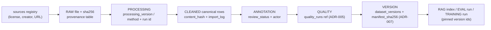

# ADR-018: Data lineage — in-DB provenance chain + manifest hashes

| | |
|---|---|
| Status | **ACCEPTED** |
| Date | 2026-09-30 |
| Decision owner | founder |
| Decision | **CONFIGURE lineage inside the canonical DB (sources registry + provenance columns + `data_audit_log` + manifest hashes); DEFER external lineage platforms** |
| Revisit when | Lineage must be queried across ≥3 external systems, or catalog governance needs column-level lineage at scale → DataHub first (Apache 2.0) |
| Evidence | [Provenance §1–5](../data/provenance.md) · [Tool matrix §4](../research/data-platform-tool-matrix.md) · [ADR-004](ADR-004.md) · [ADR-007](ADR-007.md) |

## Context

"Every dataset has provenance" is a project constraint, and the brief's provenance question
list (10 questions: where did this sentence come from, which dataset version contains it, who
reviewed it, which eval used it, which model trained on it, …) is already mapped to concrete
mechanisms in [provenance §4](../data/provenance.md#4-every-provenance-question--where-it-is-answered).
Much of the chain **exists**: the `provenance` table (file → script → table), `data_audit_log`
(30,745 rows, append-only), L1.3 provenance columns on `dictionary`/`vocabulary`/
`zolai_vocabulary`, `import_log` (92 runs with `source_file` + `sha256`). What is missing is
the decision record: lineage is assembled from our own tables and hashes, not bought as a
platform — and which columns/links close the remaining PARTIAL answers (Phase 9).

## Problem

We must answer the provenance questions for training data, eval sets, and published datasets
— reproducible transformations, auditable human corrections, credit/license attribution —
without adopting a metadata platform. Enterprise lineage tools (OpenMetadata, DataHub) are
service-heavy, and a hand-maintained wiki drifts from the tables it describes. The lineage
system has to live next to the data, survive the SQLite → Postgres move, and stay additive to
working tables.

## Options

1. **In-DB provenance chain + manifest hashes; surface via lightweight catalog** (recommended —
   formalizes the delivered design).
2. OpenMetadata ingestion + lineage UI now.
3. DataHub with Kafka/MSA lineage ingestion now.
4. Prose/wiki lineage only (manual maintenance).

## Decision

**CONFIGURE in-DB lineage; DEFER external lineage platforms.** Tags: **CONFIGURE/BUILD**
(additive columns + registry), **DEFER** (platforms).

The chain of custody is recorded hop-by-hop in our own stores:

- **Each arrow is a recorded hop:** file hash + processing version + run id + audit row
  ([provenance §1](../data/provenance.md#1-the-provenance-chain)).
- **Lineage questions are answered by columns and rows, not by a tool:** question→mechanism
  table in provenance §4; the remaining PARTIAL items are single columns
  (`processing_method`, `actor_id`, `run_id`, `provenance_ref`, `dataset_version_id` pins).
- **Surfacing:** the lightweight catalog ([ADR-004](ADR-004.md)) renders source → table →
  dataset-version listings into `docs/database/` and serves `/api/v1/catalog` — lineage is
  read from the DB, never duplicated into a second metadata store.

## Reasons

- **The data is already 90% answerable in SQL** — `provenance`, `import_log`,
  `data_audit_log`, L1.3 columns, `dataset_versions` (manifest hash answers the
  "which DVC/data version" question while DVC stays deferred).
- **Zero new services** — matches the v1 posture; provenance lives beside the rows it
  describes, so it cannot drift.
- **Portable across the DB migration:** tables + hashes are dialect-neutral; only additive
  DDL differs ([ADR-015](ADR-015.md)).
- **License/credit hygiene depends on it:** `VALID_SOURCE` quality rule + publish gate
  require a license/credit row before any dataset publishes — a platform would not enforce
  that; our gate does.

## Consequences

- Phase 9 lands the additive columns/links listed in provenance §2–§4 (extend-don't-fork
  naming: one name per concept, documented reverse SQL).
- The publish gate grows a provenance-completeness check (lifecycle condition 3): a version
  with an unanswerable provenance question cannot publish.
- Lineage debugging = SQL + catalog pages, not a graph UI — acceptable at solo-founder scale;
  the revisit trigger covers the day a graph UI is genuinely needed.
- Wiki/prose lineage stays deprecated as a source of truth (links only).

## Rejected alternatives

- **OpenMetadata now:** DEFER/REJECT for v1 — ingestion + UI ships under the Collate
  Community License since 1.6.0 (verified, matrix §4) plus multi-service cost for metadata we
  already store.
- **DataHub now:** DEFER — Apache 2.0 and the pre-approved first pick at the trigger
  (≥3 external systems / column-level lineage at scale), but Kafka-heavy: a new pipeline for
  zero external systems today.
- **Manual wiki lineage:** rejected — drifts from tables by construction; already the failure
  mode we are closing (current-state gap: provenance-not-surfaced).

## Migration implications

- Phase 9 (provenance/immutability/versioning) delivers columns + registry + catalog render;
  Phase 2 keeps OLD→NEW mapping for any renamed concepts (none planned — additive only).
- Backfill: existing rows keep legacy `pos`/`source` values; new columns start `NULL` and
  fill as pipelines re-run — no rewrite of working tables (backup-first rule still applies
  when backfill touches data).
- If the platform trigger ever fires: side-by-side ingestion from our tables into DataHub,
  with the DB remaining the system of record (no cutover of provenance ownership).

**Related:**
[ADR-004 (catalog)](ADR-004.md) · [ADR-007 (versioning)](ADR-007.md) · [ADR-015 (schema governance)](ADR-015.md) ·
[ADR-017 (lifecycle)](ADR-017.md) · [Provenance](../data/provenance.md) · [Tool matrix §4](../research/data-platform-tool-matrix.md)
