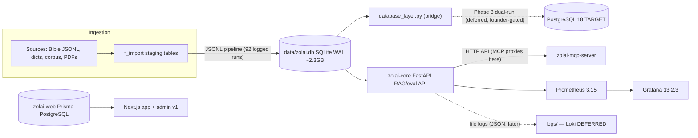

# Zolai Data Platform — Current-State Audit (2026-09-29)

> **Batch 1/3** of the Data Platform docs series. Companion docs:
> [Tool matrix](../research/data-platform-tool-matrix.md) · [ADR-001..015](../adr/ADR-001.md)
> **Scope:** docs-only audit. No code was changed for this document.

## 0. Canonical exec verdict (repeat across the series)

Smallest production-worthy stack for the next 12–24 months:

- **PostgreSQL 18 as TARGET canonical**, reached via `zolai-core/zolai/data/database_layer.py`, dual-run with SQLite until a founder-approved cutover.
- **ZERO new infra services in v1** — KEEP the just-built Prometheus 3.15 + Grafana 13.2.3 stack.
- Structured JSON file logs (**CONFIGURE**; DEFER Loki/OTel/Alertmanager).
- Lightweight in-repo catalog (**BUILD**) + custom Python quality harness with a Zolai linguistic rule registry (**BUILD**) instead of OpenMetadata/DataHub/GX/Soda.
- **No orchestrator in v1** (**CONFIGURE** cron + `pipeline_runs` tables + CLI; revisit Dagster at ≥10 interdependent pipelines).
- Dataset versioning = manifest + hashes + immutable published snapshots (**CONFIGURE**; DVC later for >1GB training artifacts).
- DB-first RAG observability (**CONFIGURE** on `eval_runs`; DEFER Langfuse/Phoenix/MLflow).
- Action-based RBAC on existing Prisma Role/Permission models + API-key auth for zolai-core (**BUILD**, P0 gap).
- Custom thin Next.js admin in zolai-web (**BUILD**); object storage / annotation tool / BI / Temporal all **DEFER** with revisit triggers.

**Net new containers in v1: 0–1 (Postgres only, Phase 3).**

Decisions are recorded verbatim in [ADR-001..015](../adr/ADR-001.md) and as rows in the
[tool matrix](../research/data-platform-tool-matrix.md).

---

## 1. Method & evidence

Read-only audit performed 2026-09-29:

| Evidence | What it showed |
|---|---|
| Live query on `data/zolai.db` (`sqlite_master`) | table count (see §2.1 discrepancy note) |
| `docs/database/tables.md` (updated 2026-09-28) | 101-table catalog, row counts, staging/archive status |
| `zolai-core/pyproject.toml` | deps: SQLAlchemy, `prometheus-client==0.26.0`, `psycopg2-binary`; CLI entry points |
| `zolai-web/prisma/schema.prisma` | `provider = "postgresql"`, 66 Prisma models |
| `zolai-core/docs/MONITORING.md` | Prometheus 3.15.0 + Grafana 13.2.3 runbook, endpoints, dashboards, alert rules |
| `zolai-core/zolai/api/server.py` router wiring | route counts, `/api/v1` prefix usage, **no API-key auth found** |
| `zolai-core/zolai/monitoring/alerts.py` `RULES` | exactly 3 alert rules (parity-gated) |

No cross-repo globbing was performed from the workspace root (per `AGENTS.md` scoping).

---

## 2. Data stores

### 2.1 Canonical store — SQLite (`data/zolai.db`)

| Property | Value | Evidence |
|---|---|---|
| Engine | SQLite, WAL mode, `busy_timeout=30000` | `docs/database/tables.md` |
| Disk size | ~2.3 GB | `tables.md` / `MONITORING.md` |
| Rows | ~3.3M across all tables | `tables.md` |
| Tables | **live count = 105 non-internal tables (queried 2026-09-29)**; `tables.md` documents **101** (2026-09-28) | drift → logged as Low-severity gap §7 |
| Access pattern | `config.paths.data / "zolai.db"` — reads from DB, never raw JSONL | `tables.md` §7 |
| Integrity hardening | FK guard at startup, integrity checks, migrations (27 constraints, 50+ indexes) | `zolai-core/zolai/data/{integrity,migrations}.py` |
| Change tracking | `data_audit_log` — 30,745 rows (who/why/when, old→new) | `tables.md` §2.11 |
| Import bookkeeping | `import_log` — 92 runs. `jsonl_import_log` exists but is **empty (0 rows)** — duplicate/legacy (the `jsonl_pipeline*.py` models write `import_log`) | live `sqlite3` query 2026-09-30; `tables.md` still attributes the 92 rows to `jsonl_import_log` (Phase 0 re-audit) |
| Eval store (DB-first) | `eval_sets` (3), `eval_cases` (273), `eval_runs` (gate history) | `tables.md` §2.12; `zolai/data/migrations.py:1347` |
| Staging | 26 `*_import` tables ≈ **1.52M** intermediate rows (1,517,212 live, 2026-09-30); `tables.md` says ~1.79M → pending Phase 0 re-audit; archive plan PROPOSED, nothing deleted | live `sqlite3` query 2026-09-30 |

**Role today:** transitional canonical store for everything linguistic
(dictionary 84,490 · bible_verses 31,649 · translations 207,623 · word_usage 269,903 ·
training_exercises 82,159 · syllable_data 189,563 · …).

### 2.2 Application store — Prisma/PostgreSQL (zolai-web)

| Property | Value | Evidence |
|---|---|---|
| Provider | `postgresql` | `zolai-web/prisma/schema.prisma` line 7 |
| Models | **66** (`model …` count) | same file |
| Domains | identity (`User`, `Session`, `Account`, `TwoFactor`, `Verification`), content (`Post`, `PageTemplate`, `Taxonomy`, `Comment`, `Revision`), security/audit (`AuditLog`, `RateLimit`, `SecurityEvent`, `LoginHistory`, `Backup`), notifications, site settings | model list |
| Relationship to canonical | **Separate database, separate concern** — app/metadata, not linguistic corpus | architecture invariant: metadata ≠ canonical app data |

This is why "Prisma already targets PostgreSQL" is a standing argument for
[ADR-001](../adr/ADR-001.md): one relational engine across the platform.

### 2.3 Bridge layer — `zolai-core/zolai/data/database_layer.py`

Exists alongside `database.py` (SQLAlchemy access), `integrity.py`, `migrations.py`,
`versioning.py`, `sync.py`, `repositories/`, `services/`. It is the intended
abstraction for a SQLite→PostgreSQL dual-run — **CONFIGURE/extend, do not rewrite**.

---

## 3. Ten-repo map (data-platform touchpoints)

| Repo | Role | Data-platform touchpoint |
|---|---|---|
| `.github` (root) | Org profile + workflows | `lint.yml` (ruff, scripts-scoped) |
| `zolai-core` | Python toolkit + RAG brain, canonical DB reader/writer | SQLite store, FastAPI, metrics stack, eval store, pipelines, **target home of PG bridge** |
| `zolai-web` | Learner platform (Next.js + Prisma) | Separate Prisma PostgreSQL (66 models), cron `health` route, **admin v1 home** |
| `zolai-datasets` | Corpora/datasets build+publish | dataset manifests/exports; git-ignored bulk data |
| `zolai-training` | LoRA/QLoRA → GGUF | consumes published datasets; future MLflow trigger (ADR-013) |
| `zolai-wiki` | Knowledge base | content source into lessons/articles tables |
| `zolai-tauri` | Offline desktop | reads core API/DB bundle offline |
| `zolai-mcp-server` | Cloudflare Workers MCP | proxies to zolai-core API (no direct DB) |
| `zolai-landing` | Org site (Cloudflare Pages) | no data-plane role |
| `zolai-ai.github.io` | GitHub Pages | no data-plane role |

Shared bulk data lives in git-ignored `data/` (never in Git — constraint).

---

## 4. Monitoring & observability inventory (KEEP)

Full runbook: [`zolai-core/docs/MONITORING.md`](../../zolai-core/docs/MONITORING.md)
(relative path assumes sibling `zolai-core` checkout).

| Component | Version / state | Disposition |
|---|---|---|
| Prometheus | **3.15.0** (`docker-compose.monitoring.yml`) | **KEEP** ([ADR-002](../adr/ADR-002.md)) |
| Grafana | **13.2.3**, provisioned via `ops/grafana/` | **KEEP** |
| Instrumentation | `zolai/monitoring/` + `prometheus-client==0.26.0` (pinned) | **KEEP** |
| Metrics REST | `zolai/api/metrics_router.py` — 11 endpoints (`/metrics`, `/api/metrics/{summary,health,eval,performance,alerts,info,annotations…}`) mounted before catch-all | **KEEP** |
| Dashboards | 3 provisioned: `api-overview`, `database-storage`, `linguistic-pipeline` | **KEEP** |
| Alert rules | **3** in `zolai/monitoring/alerts.py::RULES` — `http_error_rate_high` (critical), `http_latency_p95_high` (warning), `db_query_p95_high` (warning); parity-gated by `tests/test_alert_rules_parity.py` across `RULES` ↔ Prometheus files ↔ Grafana `rules.yml` | **KEEP** (alert-parity gate = already solved) |
| Log aggregation | none — host/API file logs only | **CONFIGURE** structured JSON + rotation; **DEFER** Loki/OTel/Alertmanager ([ADR-003](../adr/ADR-003.md)) |
| Tracing | none — latency covered by `/api/metrics/performance` | **DEFER** (revisit: recurring cross-service latency debugging) |
| DB integrity | startup FK guard → `DB_INTEGRITY_STATUS`, `zolai_db_integrity_status` gauge | **KEEP** |

Metric naming: `zolai_<domain>_<metric>` (HTTP, DB, analysis, corpus, eval, alert, build-info).

---

## 5. API surface

### 5.1 zolai-core (FastAPI)

| Router | Mount | Routes (counted 2026-09-29) |
|---|---|---|
| `server.py` direct `@app.*` routes | `/`, `/health`, `/api/...` | ~52 |
| `foundation_router` | **`/api/v1`** (then `/foundation/…`) | 22 |
| `metrics_router` | `/metrics`, `/api/metrics/*` (before catch-all) | 11 |
| `ui_router` | mounted | — |
| `desktop_router` (12) + `jsonl_router` (7) | `include_router` **commented out**, but routes mounted via `app.router.routes.append` (`server.py:369-373`) | 19 |

Findings:

- **Total surface ≈ 104 routes (52 + 22 + 11 + 19).** The desktop/jsonl rows are live
  despite the commented `include_router` lines — `server.py` appends their
  `router.routes` directly (`desktop_router` 12 + `jsonl_router` 7 = 19).
- A **partial `/api/v1` discipline already exists** (foundation router) but most
  legacy routes are unversioned → full discipline **BUILD** in [ADR-014](../adr/ADR-014.md).
- **No API-key auth found** in `server.py` (grep over the server returned no
  `api_key` handling) — matches the long-standing "API-key auth + per-key/organization
  limits PENDING" note in `context/progress-tracker.md`. **P0 gap** (ADR-014).
- Consumers: `zolai-mcp-server` (proxies dictionary/bible lookups), `zolai-tauri`
  (offline mode), zolai-web where applicable.

### 5.2 zolai-web (Next.js)

Next.js app-router routes + Prisma identity models (`User`/`Session`/`Account`/`TwoFactor`)
for session auth; security models (`RateLimit`, `SecurityEvent`, `AuditLog`, `Backup`)
exist for auditability. Action-based RBAC (**BUILD**) will map onto the existing
Role/Permission-style models — see [ADR-010](../adr/ADR-010.md).

---

## 6. Jobs & pipelines today

| Job class | What exists | Bookkeeping |
|---|---|---|
| JSONL ingestion | `zolai/core/jsonl_pipeline.py` + `_v2` + `_v3` → `*_import` staging → canonical promotion | `import_log` (92 rows; `jsonl_import_log` = 0 rows, empty legacy) |
| Pipeline scripts | `zolai-core/scripts/pipelines/`: `ingest_v2.py`, `clean.py`, `align.py`, `deduplicate.py`, `export.py`, `collect.py`, `convert_linguistics.py`, `convert_usx.py`, `run.py` | **no `pipeline_runs` table** (gap §7) |
| Batch/maintenance | `scripts/maintenance/`, `scripts/data_pipeline/`, `scripts/dictionary/`, `scripts/cleaner/`, `scripts/eval/` (e.g. `seed_eval_sets.py`) | ad-hoc |
| CLI entry points | `zolai`, `zolai-zvs`, `zolai-eval` (`pyproject.toml [project.scripts]`) | eval writes `eval_runs` |
| CI (GitHub Actions) | root `lint.yml`; zolai-core `ci.yml`; zolai-web `test.yml`, `monitor.yml`, `deploy.yml` (deploy = manual dispatch) | per-repo |
| Cron/scheduled | zolai-web `app/api/cron/health/route.ts`; no systemd/cron unit found for core batch jobs | partial |
| Evaluation | `zolai-eval` → `eval_sets`/`eval_cases` → `eval_runs` gates surfaced in `/api/metrics/eval` + Grafana | **DB-first, solved** |

**Disposition:** **CONFIGURE** cron/systemd + a `pipeline_runs` table + CLI run records;
**DEFER** any orchestrator service until ≥10 interdependent pipelines or missed runs
([ADR-006](../adr/ADR-006.md)).

---

## 7. Gap analysis (vs. target platform)

| # | Gap | Severity | Disposition |
|---|---|---|---|
| G1 | No PostgreSQL canonical yet — SQLite single-writer only; Prisma web DB separate | **High** | **ADOPT** PG18 target via bridge, dual-run (ADR-001); cutover = founder-gated |
| G2 | No API-key auth / per-org limits on zolai-core API | **Critical (P0)** | **BUILD** API keys + scopes (ADR-014) |
| G3 | No RBAC enforcement surface for data actions (models exist, action matrix unmapped) | **Critical (P0)** | **BUILD** action-based RBAC (ADR-010) |
| G4 | No data catalog beyond `docs/database/tables.md` | **High** | **BUILD** lightweight catalog tables + generated docs + `/api/v1/catalog` (ADR-004); DEFER enterprise catalog |
| G5 | No formal quality suite beyond eval gates; linguistic rules (ZVS 2018, SOV, ergative `in`, unicode) unformalized as registered rules | **High** | **BUILD** pytest-style harness + DB rule registry (ADR-005); DEFER GX/Soda |
| G6 | No dataset versioning/immutability enforcement (checksums, `dataset_versions`) | **High** | **CONFIGURE** manifest+hash+tables (ADR-007); DEFER DVC until >1GB artifacts |
| G7 | No `pipeline_runs` bookkeeping; runs only partially logged (`import_log`, 92 runs — `jsonl_import_log` exists but is empty, 0 rows: duplicate/legacy) | **Medium** | **CONFIGURE** table + CLI wiring (ADR-006) |
| G8 | No annotation workflow — L1 gold sets are CSV/JSONL files in Git | **Medium** | **DEFER** tool; needs-founder-decision on volume; Label Studio preferred when started (ADR-011) |
| G9 | No admin UI for linguistic workflows (POS review, quality runs, publish, eval inspect) | **Medium** | **BUILD** thin Next.js admin in zolai-web (ADR-009) |
| G10 | No `/api/v1` discipline on legacy routes | **Medium** | **CONFIGURE/BUILD** versioned surface + freeze (ADR-014) |
| G11 | No structured logging convention (ad-hoc file logs) | **Medium** | **CONFIGURE** JSON + rotation; DEFER Loki/OTel/Alertmanager (ADR-003) |
| G12 | No RAG trace tables (`rag_traces`); regressions only diagnosable via `eval_runs` | **Medium** | **CONFIGURE** DB-first traces (ADR-012); DEFER Langfuse/Phoenix |
| G13 | Provenance chain exists (`data_audit_log`, `pos` columns) but is not surfaced/catalogued; dataset-level provenance links incomplete | **Medium** | **CONFIGURE** provenance columns + lineage views (data/provenance doc, batch 2) |
| G14 | Table-count doc drift: live 105 vs documented 101 vs brief 103 | **Low** | re-audit counts at Phase 0 backup baseline; fix in `tables.md` during Phase 2 mapping |
| G15 | BI/analytics for non-SQL consumers: none | **Low** (need = UNKNOWN, needs-founder-decision) | **DEFER**; interim = Grafana `data` folder |

### Already solved — do NOT redo

Metrics exposition · dashboards · alert-rule parity gate · DB integrity hardening
(FK guard, WAL, migrations) · eval history (`eval_runs` + `/api/metrics/eval`).

---

## 8. Related docs

- [ADR-001 — PostgreSQL target](../adr/ADR-001.md) · [ADR-002 — keep metrics stack](../adr/ADR-002.md) · [ADR-014 — /api/v1 + API keys](../adr/ADR-014.md)
- [Tool matrix](../research/data-platform-tool-matrix.md) — every tool evaluated, with licenses/status
- [`docs/database/tables.md`](../database/tables.md) — table catalog this audit builds on
- Batch 2/3 (series): architecture overview, data-platform, observability, integrations, data model, lifecycle, quality, provenance, versioning
