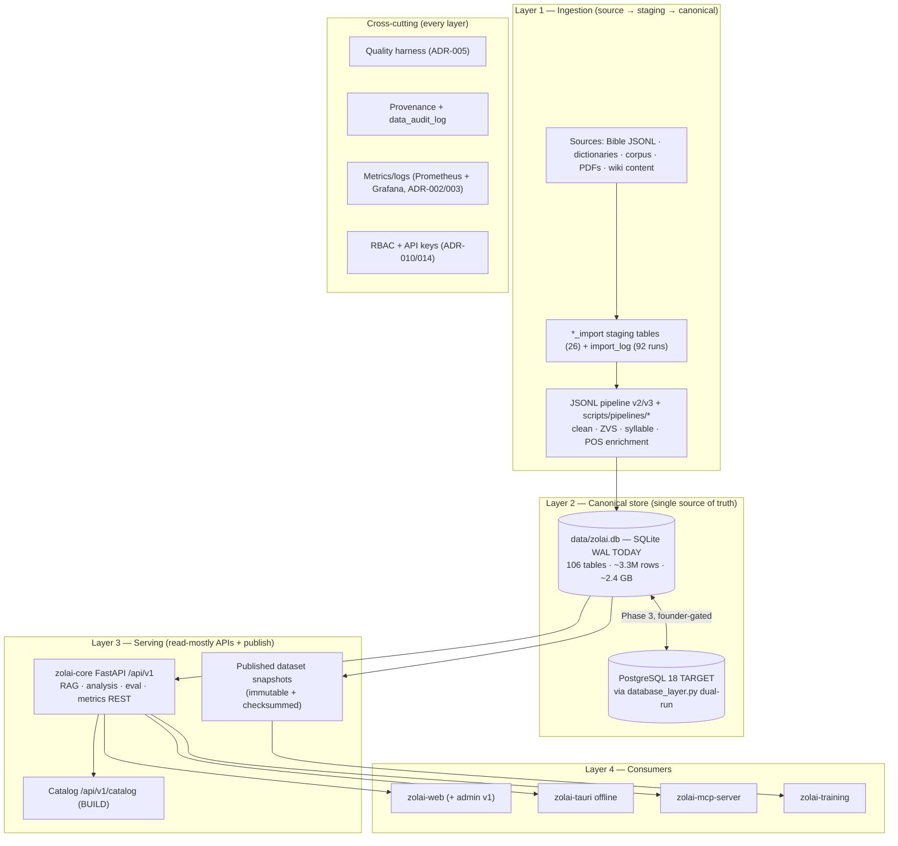

# Data Platform — Layered Design

> **Batch 2/3** of the Data Platform docs series.
> Companions: [overview](overview.md) · [current-state audit](current-state.md) ·
> [observability](observability.md) · [integrations](integrations.md) · [data model](../data/data-model.md) ·
> [ADR-001..015](../adr/ADR-001.md)

## 1. Layering: ingestion → canonical → serving

Rules of the layers:

- **Ingestion is idempotent:** every import is keyed by `sha256` + `batch_id`
  (`import_log`), re-runs never duplicate rows.
- **Canonical is single-writer:** only `zolai-core` data managers write it
  (see [module boundaries](overview.md#4-module-boundaries)).
- **Serving is read-mostly:** API + catalog + published snapshots; writes go back through
  audited managers, never raw SQL from consumers.
- **Nothing crosses a layer without provenance** ([provenance](../data/provenance.md)) and,
  for publishes, a passing quality run ([quality](../data/quality.md)).

## 2. The 10 data domains

Every table in the canonical store belongs to exactly one domain
(full table specs: [data model](../data/data-model.md)).

| # | Domain | Purpose | Primary tables (today → target) | Owner |
|---|---|---|---|---|
| 1 | **identity** | Users, roles, permissions, API keys | Prisma `User`/`CustomRole`/`Permission`/`RolePermission` (exists); core `api_keys` (**PROPOSED**, ADR-014) | zolai-web / zolai-core |
| 2 | **source** | Where data came from; file-level lineage | `provenance` (exists); `sources` registry (**PROPOSED**) | zolai-core |
| 3 | **dataset** | Dataset catalogue, versions, immutability | `datasets`, `dataset_versions` (**PROPOSED**, ADR-007) | zolai-core |
| 4 | **linguistic** | The language itself: lexicon, POS, morphology, grammar, corpus | `dictionary`, `vocabulary`, `bible_verses`, `grammar_patterns`, `syllable_data`, `word_alignments`, `pos_canonical` columns (exists) | zolai-core |
| 5 | **annotation** | Human review / gold sets | gold sets = CSV/JSONL in Git (exists); `annotation_*` tables **DEFERRED** (ADR-011) | zolai-datasets → tool later |
| 6 | **quality** | Rule registry + run results | `quality_rules`, `quality_runs`, `quality_results`, `quality_issues` (**PROPOSED**, ADR-005) | zolai-core |
| 7 | **pipeline** | Batch job bookkeeping | `import_log` (exists, 92 runs; `jsonl_import_log` = empty, 0 rows); `pipeline_runs` (**PROPOSED**, ADR-006) | zolai-core |
| 8 | **evaluation** | Eval sets, cases, run history, gates | `eval_sets`, `eval_cases`, `eval_runs`, `monitoring_annotations` (exists) | zolai-core |
| 9 | **rag** | Retrieval artifacts: chunks, embeddings, traces | `knowledge_vectors`, `canonical_sentences` (exists); `rag_traces` (**PROPOSED**, ADR-012) | zolai-core |
| 10 | **audit** | Change tracking, chain of custody | `data_audit_log` (exists, 30,745 rows); Prisma `AuditLog`/`SecurityEvent` | zolai-core / zolai-web |

## 3. Database roles

| Engine | Role | Status | Decision |
|---|---|---|---|
| **SQLite** (`data/zolai.db`, WAL, `busy_timeout=30000`) | **Transitional canonical** — everything linguistic, today | LIVE | **KEEP** until founder-approved cutover ([ADR-001](../adr/ADR-001.md)) |
| **PostgreSQL 18** | **Target canonical** — one relational engine across the platform (Prisma already PG) | PLANNED Phase 3 bring-up, dual-run via `database_layer.py`; cutover = Phase 4, **founder-gated** | **ADOPT** ([ADR-001](../adr/ADR-001.md)) |
| **PostgreSQL (Prisma)** | App/metadata store for zolai-web (66 models: identity, content, security) | LIVE | **KEEP** — separate concern, metadata ≠ canonical corpus |
| **DuckDB** | Optional embedded **ad-hoc analytics** on exported flat files; never multi-writer, never canonical | NOT IN USE | **DEFER** (ad-hoc role only) |
| ClickHouse / other OLAP | Analytical column store | — | **REJECT** as canonical — overkill below ~10M rows |

Single-writer pressure is the forcing function (SQLite lock contention as quality runs,
catalog, admin, and API all write); it is the *reason* Postgres is the target, not a
preference for new tech — see [ADR-001](../adr/ADR-001.md) §Problem.

## 4. What ships in v1 vs explicitly not

### 4.1 Ships in v1 (BUILD / CONFIGURE / KEEP / ADOPT)

| # | Item | Tag | Notes |
|---|---|---|---|
| 1 | Keep SQLite as canonical while bridge work lands | **KEEP** | no rewrite of a working system |
| 2 | PostgreSQL 18 bring-up + `database_layer.py` dual-read | **ADOPT/CONFIGURE** | Phase 3; cutover founder-gated (Phase 4) |
| 3 | Prometheus 3.15 + Grafana 13.2.3 + REST metrics + alert parity gate | **KEEP** | [observability](observability.md) |
| 4 | Structured JSON file logs + rotation | **CONFIGURE** | ADR-003 |
| 5 | Catalog tables + generated docs + `/api/v1/catalog` | **BUILD** | ADR-004 |
| 6 | Quality harness + DB rule registry incl. Zolai linguistic rules | **BUILD** | ADR-005 → [quality](../data/quality.md) |
| 7 | `pipeline_runs` + cron/systemd + CLI run records | **CONFIGURE** | ADR-006 |
| 8 | Manifest + hash + `dataset_versions`; immutable publishes | **CONFIGURE** | ADR-007 → [versioning](../data/versioning.md) |
| 9 | Action-based RBAC + API keys on `/api/v1` | **BUILD** | ADR-010/014 — P0 |
| 10 | Thin Next.js admin in zolai-web | **BUILD** | ADR-009 |
| 11 | DB-first RAG observability (`eval_runs` now, `rag_traces`) | **CONFIGURE** | ADR-012 |
| 12 | Provenance columns surfaced + lineage docs | **CONFIGURE** | [provenance](../data/provenance.md) |

### 4.2 Explicitly NOT in v1 (DEFER / REJECT) — with revisit triggers

| Item | Tag | Revisit when |
|---|---|---|
| Object storage (MinIO/Garage/SeaweedFS) | **DEFER** (MinIO **REJECT** — archived Feb 2026, AGPLv3) | Serving/publishing multi-GB artifacts → R2 or B2 |
| Orchestrator (Airflow/Prefect/Dagster/Temporal/n8n) | **DEFER** (n8n **REJECT**) | ≥10 interdependent pipelines or missed runs → Dagster |
| Enterprise catalog (OpenMetadata/DataHub/Amundsen) | **DEFER** (Amundsen **REJECT** — archived; OpenMetadata UI = Collate license) | Multi-team consumers or >200 governed assets → DataHub |
| GX / Soda quality platforms | **DEFER** (Soda **REJECT** — ELv2) | Generic non-linguistic rules >~50 → GX Core |
| Loki / OTel / Alertmanager | **DEFER** | 2nd service or unsearchable log volume → Loki |
| Distributed tracing (Tempo/Jaeger/OTel) | **DEFER** | Cross-service latency debugging becomes recurring |
| Annotation tool (Label Studio preferred) | **DEFER** — needs-founder: annotation volume | First 5+ external annotators |
| BI (Superset/Metabase) | **DEFER** — interim = Grafana `data` folder; need UNKNOWN | First community analyst self-serve need |
| MLflow | **DEFER** | >10 training runs/mo needing comparison |
| Langfuse / Phoenix for RAG tracing | **DEFER** (Phoenix first if triggered) | RAG regressions untraceable from evals |
| DVC | **DEFER** | Training artifacts >1 GB leave Git |
| SSO / IdP (Keycloak/Ory) | **DEFER** | First external role or SSO requirement |
| Kubernetes | **REJECT** | never under current scale; compose-only invariant |

## 5. Related docs

- [Architecture overview](overview.md) — diagrams, module boundaries, invariants
- [Observability](observability.md) · [Integrations](integrations.md)
- [Data model](../data/data-model.md) · [Quality](../data/quality.md) · [Versioning](../data/versioning.md)
- [Tool matrix](../research/data-platform-tool-matrix.md) — decision + URL/license/status/evidence; WHY / WHY NOT live in ADR Reasons / Rejected alternatives
- Migration roadmap + backlog: `docs/planning/DATA_PLATFORM_MIGRATION.md` (batch 3 of the series)
