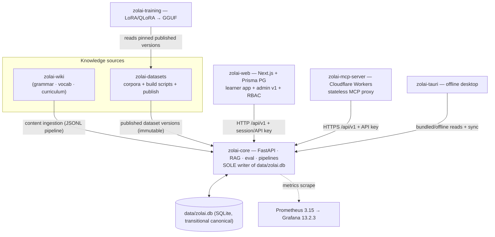
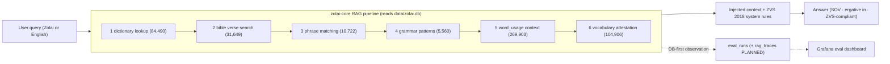

# Integrations — Repos, API Contract, RAG Flow

> **Batch 2/3** of the Data Platform docs series.
> Companions: [overview](overview.md) · [current-state §3/§5](current-state.md) ·
> [data-platform](data-platform.md) · [ADR-010](../adr/ADR-010.md)/[ADR-014](../adr/ADR-014.md) (auth & API) ·
> [ADR-012](../adr/ADR-012.md) (RAG observability).

## 1. How the repos talk

Direction rules:

1. **Everything reads linguistic data through zolai-core.** No other repo opens
   `data/zolai.db` for write; zolai-web does not touch it at all (it has its own Prisma PG).
2. **Knowledge flows inward:** zolai-wiki and zolai-datasets feed ingestion; they never serve
   queries.
3. **Consumers are stateless or pinned:** MCP proxies; tauri bundles an offline snapshot and
   re-syncs; training pins an immutable dataset version.
4. **Landing / GitHub Pages** have no data-plane role (marketing only).

## 2. API contract

Cross-cutting conventions (endpoint catalog, pagination, filtering/sorting/search, bulk ops,
idempotency, rate limits, error format, validation, audit hooks, webhooks, background jobs):
**[API design](api-design.md)**.

| Aspect | v1 contract | Decision |
|---|---|---|
| Base path | `/api/v1` for all new + migrated routes; legacy unversioned routes frozen, then migrated | **BUILD** ([ADR-014](../adr/ADR-014.md); foundation router already at `/api/v1`) |
| Auth | API key per consumer (header), scopes per action; session auth stays in zolai-web | **BUILD** — P0 gap G2 ([ADR-014](../adr/ADR-014.md)) |
| Authorization | Action-based RBAC on Prisma `CustomRole`/`Permission`/`RolePermission` + `UserRole` enum; core maps key scopes → same action names | **BUILD** — P0 gap G3 ([ADR-010](../adr/ADR-010.md)) |
| Error shape | Consistent JSON `{error: {code, message, details}}`; no stack traces publicly | **CONFIGURE** |
| Metrics | `/metrics` + `/api/metrics/*` stay unauthenticated-scope but bind internally (no public exposure) | **KEEP** ([ADR-002](../adr/ADR-002.md)) |
| Catalog | `GET /api/v1/catalog` — read-only dataset/table metadata | **BUILD** ([ADR-004](../adr/ADR-004.md)) |
| Compatibility | Additive changes only within v1; breaking changes bump to `/api/v2` | **CONFIGURE** |

Consumers and their contract expectations:

| Consumer | Protocol | Auth | Notes |
|---|---|---|---|
| zolai-web | HTTP `/api/v1` | session (user) + server API key | admin v1 uses the same contract |
| zolai-mcp-server | HTTPS → Workers → core | API key (secret in Workers) | proxies dictionary/bible/RAG lookups; **no direct DB** |
| zolai-tauri | HTTP when online; bundled DB/API snapshot offline | API key embedded in app config | offline mode is a read replica, not a writer |
| zolai-training | filesystem/registry of published versions | n/a | never calls live API for bulk reads |
| zolai-datasets (publish) | CLI → core | founder API key | publish path enforces quality gate + checksum |

## 3. RAG flow

- MCP path: ChatGPT/Gemini/Claude → `https://mcp.zolai.space/mcp` → Workers → core `/api/v1`.
- Observability of retrieval is **DB-first** ([ADR-012](../adr/ADR-012.md)); no vendor tracer.
- Corpus invariants feed the flow: ZVS 2018 orthography, SOV, ergative `in` are enforced on
  stored data (quality rules) and re-checked on output.

## 4. Data ownership per repo

| Repo | Owns (write) | Reads | Never |
|---|---|---|---|
| `zolai-core` | `data/zolai.db` canonical schema + rows; `zolai/monitoring/`; eval store; quality/catalog/pipeline tables (planned) | wiki content, dataset publishes | app/metadata tables (Prisma) |
| `zolai-web` | Prisma PostgreSQL (identity, content, security, audit); admin UX | core `/api/v1` | `data/zolai.db` |
| `zolai-datasets` | source corpora, build scripts, publish manifests, git-ignored bulk exports | canonical DB via export tooling | canonical tables directly (goes through core pipelines) |
| `zolai-training` | training run configs, LoRA/GGUF artifacts (git-ignored; DVC at >1 GB) | pinned published dataset versions | staging `*_import` tables, live DB writes |
| `zolai-wiki` | markdown/lesson source content | — | canonical tables (flows through ingestion) |
| `zolai-mcp-server` | Workers config/routes | core API | any database |
| `zolai-tauri` | app bundle + local cache | core API / bundled snapshot | shared canonical DB |
| `zolai-landing`, `zolai-ai.github.io` | static site assets | — | data plane |
| `.github` (root) | org workflows (`lint.yml`) | — | — |

Shared rule: bulk data lives in git-ignored `data/` at the workspace — **large data never in Git**
([invariants](overview.md#5-invariants-standing-rules--violations-block-merge)).

## 5. Extension points

| When you need to… | Extend via | Contract to keep |
|---|---|---|
| Add a new API consumer | issue API key + scope ([ADR-014](../adr/ADR-014.md)) | `/api/v1`, error shape, RBAC action names |
| Add a new dataset/source | ingestion pipeline + `sources`/`provenance` rows → quality run → publish | idempotency (sha256), immutable publish, provenance columns |
| Add a new metric | `zolai/monitoring/` + REST exposure + dashboard row | `zolai_<domain>_<metric>`; alert ⇒ 3-way parity test |
| Add a quality rule | rule registry row + pytest-style check ([quality](../data/quality.md)) | severity/action recorded; blocker rules gate publish |
| Add a catalog entry | catalog tables + generated docs | `/api/v1/catalog` read-only; no PII/secrets |
| Add a workflow to admin | thin Next.js route in zolai-web ([ADR-009](../adr/ADR-009.md)) | RBAC action + audit event for every mutation |
| New repo joining the platform | follow this map; declare data ownership | modular monolith, no new infra service without an ADR |

## 6. CI/CD integration points

| Repo | Workflow | Gate |
|---|---|---|
| root `.github` | `lint.yml` (ruff, scripts-scoped) | style |
| zolai-core | `ci.yml` + alert-parity test + targeted pytest | parity gate, eval smoke |
| zolai-web | `test.yml`, `monitor.yml`, `deploy.yml` (manual dispatch) | tests, landing monitor |
| zolai-datasets | manifests CI (`DATASET`/`ARCHIVE`/`DATA_INDEX`) | manifest validity |
| zolai-wiki | ZVS/markdown advisory gates | content hygiene |

Data-changing PRs additionally follow: backup → checksum → dry-run → apply → verify
([invariants §10](overview.md#5-invariants-standing-rules--violations-block-merge)).

## 7. Related docs

- [Architecture overview](overview.md) — module boundaries
- [API design](api-design.md) — cross-cutting `/api/v1` contract
- [Data platform layering](data-platform.md) · [Observability](observability.md) · [Cost model](cost-model.md)
- [Data model](../data/data-model.md) · [Provenance](../data/provenance.md)
- [ADR-014 — /api/v1 + API keys](../adr/ADR-014.md) · [ADR-010 — RBAC](../adr/ADR-010.md)
- [Tool matrix](../research/data-platform-tool-matrix.md)
