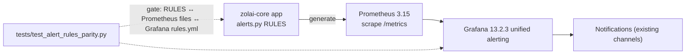

# Observability — Metrics, Logs, Traces

> **Batch 2/3** of the Data Platform docs series.
> Runbook of record: [`zolai-core/docs/MONITORING.md`](../../zolai-core/docs/MONITORING.md)
> (relative path assumes sibling `zolai-core` checkout).
> Decisions: [ADR-002](../adr/ADR-002.md) (metrics KEEP) · [ADR-003](../adr/ADR-003.md) (logs now, Loki later) ·
> [ADR-012](../adr/ADR-012.md) (RAG observability DB-first).

## 0. Disposition summary

| Signal | v1 decision | Tag | Revisit trigger |
|---|---|---|---|
| Metrics | Prometheus **3.15.0** + Grafana **13.2.3** + REST metrics | **KEEP** | Never, unless Grafana licensing posture changes |
| Dashboards | 3 provisioned (`api-overview`, `database-storage`, `linguistic-pipeline`) | **KEEP** | — |
| Alerting | Grafana **unified alerting** only; 3 rules parity-gated | **KEEP/CONFIGURE** | Alertmanager only if Grafana alerting proves insufficient |
| Logs | Structured JSON files + rotation | **CONFIGURE** | 2nd service or unsearchable volume → Loki single-binary |
| Log aggregation (Loki) | — | **DEFER** | as above ([ADR-003](../adr/ADR-003.md)) |
| Tracing (OTel/Tempo/Jaeger) | — | **DEFER** | Cross-service latency debugging becomes recurring |
| RAG observability | DB-first: `eval_runs` now, `rag_traces` planned | **CONFIGURE** | RAG regressions untraceable from evals → Phoenix first |
| Analytics/BI dashboards | Grafana `data` folder as interim | **DEFER** | First community analyst need (need = UNKNOWN, needs-founder) |

**Net: zero new observability containers in v1.** Operational observability (Grafana) stays
strictly separate from analytical dashboards (BI deferred) — no duplication.

## 1. Metrics (KEEP)

- Instrumentation: `zolai/monitoring/` + `prometheus-client==0.26.0` (pinned).
- Exposure: `/metrics` (Prometheus scrape) + 11 REST endpoints under `/api/metrics/*`
  (`summary`, `health`, `eval`, `performance`, `alerts`, `info`, `annotations`, …) mounted
  before the catch-all router (`zolai/api/metrics_router.py`).
- Naming convention: `zolai_<domain>_<metric>` (http, db, analysis, corpus, eval, alert, build).
- Evidence: [current-state §4](current-state.md#4-monitoring--observability-inventory-keep).

### 1.1 Metric inventory — exists today vs planned

**Exists today (KEEP — do not rebuild):**

| Metric | Type | What it answers |
|---|---|---|
| `zolai_http_requests_total` / `zolai_http_request_duration_seconds` / `zolai_http_requests_in_flight` | counter/histogram/gauge | API traffic + latency |
| `zolai_db_query_duration_seconds` / `zolai_db_query_errors_total` | histogram/counter | canonical DB performance |
| `zolai_db_size_bytes` / `zolai_db_table_rows` / `zolai_db_wal_bytes` / `zolai_db_integrity_status` | gauge | storage + integrity (FK guard) |
| `zolai_analysis_duration_seconds` / `zolai_analysis_operations_total` | histogram/counter | linguistic analysis work |
| `zolai_eval_runs_total` / `zolai_eval_metric_value` / `zolai_eval_last_run_timestamp_seconds` | gauge | eval gate history (DB-first) |
| `zolai_alerts_active` / `zolai_alert_state` | gauge | alert state exposure |
| `zolai_build_info` | gauge | build/version metadata |
| `zolai_dictionary_entries` / `zolai_bible_verses` / `zolai_corpus_sentences` / `zolai_vocabulary` / `zolai_words_translated_total` | gauge/counter | corpus scale at a glance |

**Planned additions (from client brief — not yet implemented; track in the batch-3 backlog
`docs/planning/DATA_PLATFORM_BACKLOG.md`):**

| Metric | Type | Answers | Depends on | Status |
|---|---|---|---|---|
| `zolai_worker_jobs_total` | counter | jobs executed per pipeline/worker, by status | `pipeline_runs` (ADR-006) | **PLANNED** |
| `zolai_queue_depth` | gauge | jobs waiting / due (cron backlog) | `pipeline_runs` + scheduler (ADR-006); no queue exists in v1 | **PLANNED** |
| `zolai_quality_failures_total` | counter | failed rows/issues per rule code | quality harness (ADR-005) → [quality](../data/quality.md) | **PLANNED** |
| `zolai_embedding_latency_seconds` | histogram | embedding call latency | RAG trace work (ADR-012) | **PLANNED** |
| `zolai_rag_latency_seconds` | histogram | end-to-end RAG query latency | RAG trace work (ADR-012) | **PLANNED** |

Adding any metric requires: name following `zolai_<domain>_<metric>`, dashboard row, and — if
an alert is attached — a row in all three parity locations (see §3).

## 2. Logs (CONFIGURE now, Loki later)

**Now (v1):** structured **JSON** file logs with rotation on the single host/API — enough for
debugging a low-traffic, single-node deployment. Convention:

- One JSON object per line: `{"ts","level","logger","msg","request_id","component", …}`.
- Never log secrets/tokens (`.env` values) or full dataset payloads.
- Rotation via logrotate/systemd journal policy — **CONFIGURE**, no new service.

**Later:** **DEFER** Loki (single binary, feeds the existing Grafana; AGPLv3 acceptable for
internal use, and Loki accepts OTLP). Trigger: a second service appears **or** log volume
becomes unsearchable in files ([ADR-003](../adr/ADR-003.md)).

**Also deferred with it:** OpenTelemetry as a second pipeline, and Alertmanager (duplicates
Grafana alerting).

## 3. Alert routing

- **Single alerting brain: Grafana unified alerting.** No Alertmanager in v1 ([ADR-003](../adr/ADR-003.md)).
- **Parity gate (already solved, keep):** `tests/test_alert_rules_parity.py` fails CI when
  `zolai/monitoring/alerts.py::RULES`, the Prometheus rule files, and Grafana `rules.yml`
  drift apart.
- **Current rules (3):** `http_error_rate_high` (critical), `http_latency_p95_high` (warning),
  `db_query_p95_high` (warning).
- Future quality alerts (e.g. `zolai_quality_failures_total` breaching) join the same three-way
  parity — never Grafana-only.

## 4. Tracing (DEFER)

Latency is already visible per-endpoint through `/api/metrics/performance`. Distributed tracing
(Tempo/OTel/Jaeger) would add a second pipeline plus a new service for a low-traffic single-node
system — **DEFER**. Trigger: cross-service latency debugging becomes recurring
(for example after a second API service exists).

## 5. RAG observability (DB-first, CONFIGURE)

Per [ADR-012](../adr/ADR-012.md): retrieval/generation quality is observed **in the database**,
not in a vendor tool.

| Piece | State | Where |
|---|---|---|
| Eval gate history | **EXISTS** — DB-first | `eval_sets` / `eval_cases` / `eval_runs`, surfaced via `/api/metrics/eval` + Grafana |
| Grafana annotations | **EXISTS** | `monitoring_annotations` table + `/api/metrics/annotations` |
| RAG traces (`rag_traces`: query, retrieved chunks, latency, answer refs) | **PLANNED** (CONFIGURE) | [data model — rag domain](../data/data-model.md) |
| Langfuse / Phoenix / Opik | **DEFER** | Phoenix first (lightest) if regressions become untraceable from evals |

The metric additions `zolai_rag_latency_seconds` / `zolai_embedding_latency_seconds` (§1.1) are
part of this workstream.

## 6. Decision rationale (metric / log / trace)

| Decision | WHY | WHY NOT | REVISIT WHEN |
|---|---|---|---|
| KEEP Prometheus + Grafana | Just built and green; dashboards + 3-alert parity gate working; evidence-driven | Replacing = violates "extend don't replace" constraint; churn with no user | Grafana licensing posture changes |
| CONFIGURE JSON file logs; DEFER Loki | Single host/API; files cover debugging; zero new services | Loki = new service; OTel = 2nd pipeline; Alertmanager duplicates Grafana | 2nd service or unsearchable volume |
| DEFER tracing | Low-traffic single-node; endpoint latency already in `/api/metrics/performance` | Tempo/OTel/Jaeger = new services | Cross-service latency debugging recurring |
| CONFIGURE DB-first RAG obs | Eval gates exist today; diagnosis happens in SQL | Langfuse = 4-service stack (PG+CH+Redis+S3); Phoenix = ELv2 server | RAG regressions untraceable from evals |
| DEFER BI in observability | Non-SQL consumer set empty; avoid duplication with Grafana | Superset = 4-part stack; Metabase AGPL + paid SSO/RLS gates | First community analyst self-serve need |

## 7. Dashboard ownership matrix (operational vs data vs AI/RAG)

The standing "no duplication" line in §0 is made explicit here — the ownership **decision**
is [ADR-016](../adr/ADR-016.md):

| Dashboard class | Examples | Owning tool (v1) | Backing store | Disposition |
|---|---|---|---|---|
| **Operational** | API traffic/latency, DB health + WAL, pipeline run outcomes, alert state | **Grafana** — sole owner (3 provisioned dashboards + unified alerting) | Prometheus `/metrics` + `/api/metrics/*` | **KEEP** ([ADR-002](../adr/ADR-002.md)) |
| **Data** | records/dataset counts, POS distribution, quality failures, annotation progress | **Zolai Admin analytics section** ([ADR-009](../adr/ADR-009.md), Phase 8); **interim before Phase 8 = Grafana `data` folder** as sole owner — it moves to admin, it never doubles | canonical DB tables (SQL) | interim **CONFIGURE**; Superset/Metabase **DEFER** — trigger: first community analyst self-serve need (**needs-founder**, BI need = UNKNOWN) ([ADR-016](../adr/ADR-016.md)) |
| **AI/RAG** | eval pass/fail + gate history, retrieval/answer quality, `rag_traces` | **Zolai Admin + eval tables** (DB-first, [ADR-012](../adr/ADR-012.md)); Prometheus/Grafana retain **latency metrics only** for this class | `eval_sets` / `eval_cases` / `eval_runs` (+ planned `rag_traces`), `/api/metrics/eval` | **CONFIGURE** now (exists); platforms **DEFER** (Phoenix first at trigger) |

**Rule: never the same dashboard in two tools.** Every panel has exactly one owner class and
one owning tool; other surfaces *link* to it, never clone it. A new dashboard request starts
by citing its row here.

## 8. Related docs

- [`zolai-core/docs/MONITORING.md`](../../zolai-core/docs/MONITORING.md) — operational runbook
- [Current-state §4](current-state.md) — inventory evidence
- [ADR-002](../adr/ADR-002.md) · [ADR-003](../adr/ADR-003.md) · [ADR-012](../adr/ADR-012.md) · [ADR-016](../adr/ADR-016.md) (dashboard ownership)
- [Quality](../data/quality.md) — how quality results surface here
- [Data platform layering](data-platform.md)
