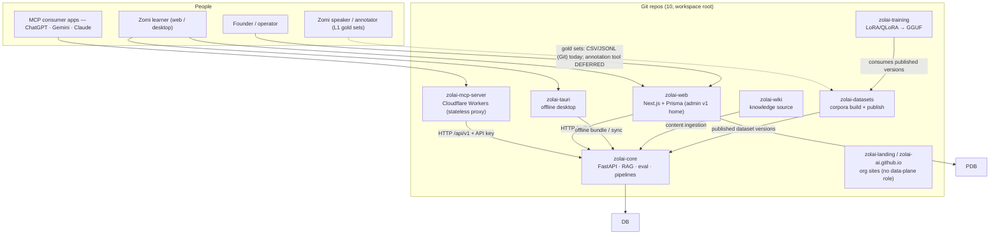
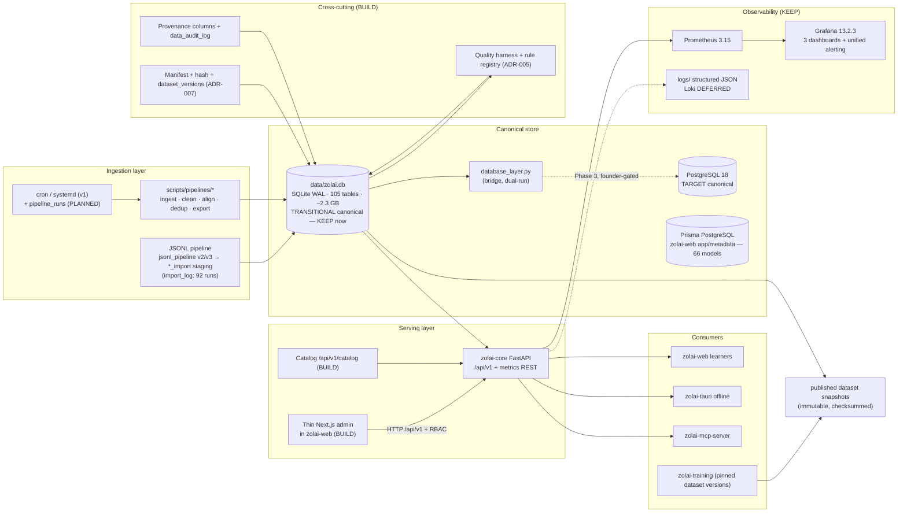

# Architecture Overview — Data Platform v1

> **Batch 2/3** of the Data Platform docs series.
> Companions: [current-state audit](current-state.md) (batch 1) · [data-platform](data-platform.md) ·
> [observability](observability.md) · [integrations](integrations.md) · [ADR-001..015](../adr/ADR-001.md) ·
> [tool matrix](../research/data-platform-tool-matrix.md)
> **Scope:** docs-only. Disposition vocabulary: `KEEP`/`ADOPT`/`DEFER`/`REJECT` for tools,
> `BUILD`/`CONFIGURE`/`INTEGRATE` for our own work. Every decision here is backed by an ADR.

## 0. Exec verdict (canonical — repeated across the series)

Smallest production-worthy stack for the next 12–24 months:

- **PostgreSQL 18 as TARGET canonical**, reached via `zolai-core/zolai/data/database_layer.py`,
  dual-run with SQLite until a founder-approved cutover ([ADR-001](../adr/ADR-001.md)).
- **ZERO new infra services in v1** — KEEP the just-built Prometheus 3.15 + Grafana 13.2.3 stack.
- Structured JSON file logs (**CONFIGURE**; DEFER Loki/OTel/Alertmanager — [ADR-003](../adr/ADR-003.md)).
- Lightweight in-repo catalog (**BUILD**, [ADR-004](../adr/ADR-004.md)) + custom Python quality harness
  with a Zolai linguistic rule registry (**BUILD**, [ADR-005](../adr/ADR-005.md)) — not OpenMetadata/DataHub/GX/Soda.
- No orchestrator in v1 (**CONFIGURE** cron + `pipeline_runs` + CLI — [ADR-006](../adr/ADR-006.md)).
- Dataset versioning = manifest + hashes + immutable published snapshots (**CONFIGURE**,
  [ADR-007](../adr/ADR-007.md); DVC later for >1 GB training artifacts).
- DB-first RAG observability (**CONFIGURE** on `eval_runs`/`rag_traces`; [ADR-012](../adr/ADR-012.md)).
- Action-based RBAC + API-key auth (**BUILD**, P0 gaps G2/G3 — [ADR-010](../adr/ADR-010.md),
  [ADR-014](../adr/ADR-014.md)); custom thin Next.js admin in zolai-web (**BUILD**,
  [ADR-009](../adr/ADR-009.md)).
- Object storage / annotation tool / BI / MLflow / Temporal all **DEFER** with revisit triggers.

**Net new containers in v1: 0–1 (Postgres only, Phase 3).**

## 1. Context diagram (C4 level 1)

Actors never touch storage directly: everything goes through zolai-core's API
(versioned surface, API keys — [ADR-014](../adr/ADR-014.md)) or through publish flows.

## 2. Container diagram (C4 level 2 — data platform)

Cross-cutting concerns (quality, provenance, versioning, catalog) are **in-process libraries +
tables**, never separate services — modular monolith, not microservices.

## 3. v1 target stack

| Group | Item | Disposition | Evidence |
|---|---|---|---|
| **Required now** | SQLite `data/zolai.db` (transitional canonical) | **KEEP** | [current-state §2.1](current-state.md) |
| **Required now** | PostgreSQL 18 (target canonical, Phase 3 bring-up) | **ADOPT** | [ADR-001](../adr/ADR-001.md) |
| **Required now** | Prometheus 3.15 + Grafana 13.2.3 + REST metrics | **KEEP** | [ADR-002](../adr/ADR-002.md) |
| **Required now** | API-key auth + action-based RBAC (P0 gaps G2/G3) | **BUILD** | [ADR-010](../adr/ADR-010.md), [ADR-014](../adr/ADR-014.md) |
| **Recommended** | Structured JSON file logs + rotation | **CONFIGURE** | [ADR-003](../adr/ADR-003.md) |
| **Recommended** | Lightweight catalog tables + `/api/v1/catalog` | **BUILD** | [ADR-004](../adr/ADR-004.md) |
| **Recommended** | Quality harness + DB rule registry (incl. Zolai rules) | **BUILD** | [ADR-005](../adr/ADR-005.md) |
| **Recommended** | `pipeline_runs` + cron/systemd + CLI run records | **CONFIGURE** | [ADR-006](../adr/ADR-006.md) |
| **Recommended** | Manifest + hash + `dataset_versions` immutability | **CONFIGURE** | [ADR-007](../adr/ADR-007.md) |
| **Recommended** | Thin Next.js admin in zolai-web | **BUILD** | [ADR-009](../adr/ADR-009.md) |
| **Recommended** | DB-first RAG traces + eval gates | **CONFIGURE** | [ADR-012](../adr/ADR-012.md) |
| **Optional** | DuckDB for embedded ad-hoc analytics | **DEFER** (never canonical) | [tool matrix §1](../research/data-platform-tool-matrix.md) |
| **Optional** | Refine inside Next.js if admin CRUD explodes (>30 resources) | **DEFER** | [ADR-009](../adr/ADR-009.md) |
| **Future** | DVC for training artifacts >1 GB | **DEFER** — trigger: artifacts leave Git | [ADR-007](../adr/ADR-007.md) |
| **Future** | Loki single-binary, Label Studio, Dagster, GX Core, Metabase/Superset, MLflow, Phoenix/Langfuse | **DEFER** — triggers in [decision table](../research/data-platform-tool-matrix.md) | matching ADRs |
| **Rejected** | MinIO, lakeFS, Dolt, n8n, Directus, Amundsen, Soda Core, ClickHouse-as-canonical, Kubernetes | **REJECT** | [tool matrix](../research/data-platform-tool-matrix.md) |

## 4. Module boundaries

| Boundary | Owner | May depend on | Must NOT |
|---|---|---|---|
| Canonical schema + migrations (`zolai/data/`: `database.py`, `database_layer.py`, `migrations.py`, `integrity.py`, `repositories/`, `services/`) | `zolai-core` | pure Python, SQLAlchemy | be written by any other repo directly |
| Canonical DB file `data/zolai.db` | `zolai-core` (sole writer via managers) | — | be opened for write by zolai-web, datasets, training, mcp |
| App/metadata DB (Prisma, 66 models) | `zolai-web` | PostgreSQL | store linguistic corpus rows |
| Raw corpora + build scripts + publish artifacts | `zolai-datasets` | shared `data/` (git-ignored) | commit bulk data to Git |
| Training datasets (pinned published versions) | `zolai-training` | published snapshots only | read `*_import` staging or scratch tables |
| RAG/eval API surface (`/api/v1`, metrics REST) | `zolai-core` | canonical DB | expose routes without version + auth plan |
| MCP proxy (stateless) | `zolai-mcp-server` | zolai-core HTTP API | open the SQLite DB or hold state |
| Learner app + admin v1 + RBAC models | `zolai-web` | Prisma PG + zolai-core HTTP | bypass RBAC for data actions |
| Monitoring stack (`zolai/monitoring/`, `ops/grafana/`, compose file) | `zolai-core` | prometheus-client (pinned) | add alert rules without the parity test |
| Knowledge source content | `zolai-wiki` | — | write canonical tables directly (flows through ingestion) |

Cross-cutting libraries (`zvs/`, `syllable/`, `pos_normalize.py`, quality harness) live inside
`zolai-core` and are imported by pipelines, API, and CLI — never copied between repos.

## 5. Invariants (standing rules — violations block merge)

1. **Published datasets are immutable.** Corrections create a new version; checksums are verified
   on read ([versioning](../data/versioning.md), [lifecycle](../data/dataset-lifecycle.md)).
2. **RBAC day-1.** Every data action maps to a permission; zolai-core requires API keys
   ([ADR-010](../adr/ADR-010.md), [ADR-014](../adr/ADR-014.md)). No anonymous write paths.
3. **Secrets live in `.env` only** — never committed; push protection active.
4. **Compose-only, no Kubernetes.** Docker Compose for services; v1 must not grow orchestrator debt.
5. **Large data never in Git.** `data/`, `node_modules/`, `.venv/` stay git-ignored; only code,
   config, and small speaker-validated gold slices (CSV/JSONL) may live in repos.
6. **RAG-first, no raw fine-tuning** as the main line — AIs consume Zolai knowledge as injected context.
7. **Linguistic core first:** POS → morphology → patterns → grammar → evaluation → then downstream
   NLP/LLM features. Do not start with translation or LLM training.
8. **Metadata ≠ canonical app data** — separate stores (Prisma PG vs `data/zolai.db`).
9. **Modular monolith over microservices**; v1 must scale without a rewrite.
10. **Every data change:** backup → checksum → dry-run → apply → verify (Phase 0 discipline).
11. **No public infra exposure** — no unauthenticated admin or DB endpoints on the public internet.
12. **Migrate, never blind-rename** working tables ([ADR-015](../adr/ADR-015.md)).

## 6. Related docs

- [Current-state audit](current-state.md) — evidence base and gap register (G1–G15)
- [Data platform layering](data-platform.md) · [Observability](observability.md) · [Integrations](integrations.md)
- [Data model](../data/data-model.md) · [Quality](../data/quality.md) · [Provenance](../data/provenance.md)
- [ADR index](../adr/ADR-001.md) · [Tool matrix](../research/data-platform-tool-matrix.md)
