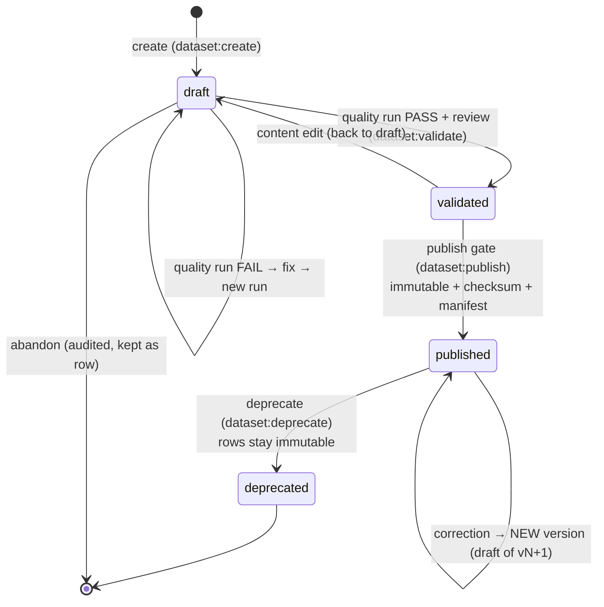
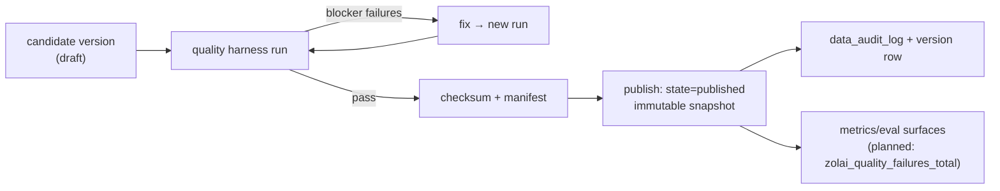

# Dataset Lifecycle

> **Batch 2/3** of the Data Platform docs series. **Status: PROPOSED** — states and gates are
> enforced starting Phase 9 (immutability/versioning); today most datasets exist without state rows.
> Governing decisions: [ADR-007](../adr/ADR-007.md) (manifest + `dataset_versions`) ·
> [ADR-005](../adr/ADR-005.md) (quality gate) · [ADR-010](../adr/ADR-010.md) (RBAC actions).
> Companions: [data model §1.3](data-model.md) · [quality](quality.md) · [versioning](versioning.md) ·
> [provenance](provenance.md).

## 1. States

| State | Meaning | Mutable? | Who can move it |
|---|---|---|---|
| `draft` | Work in progress; may be re-ingested, edited, re-run freely | yes | creator (`dataset:create`) |
| `validated` | Quality run **passed** for the proposed version; awaiting publish | content frozen, state change allowed | reviewer (`dataset:validate`) |
| `published` | **Immutable** snapshot — manifest + checksum recorded, consumers may pin it | **NO** — never updated in place | publisher (`dataset:publish`) |
| `deprecated` | Superseded or withdrawn; still readable for pinned consumers | no (advisory flag only) | publisher (`dataset:deprecate`) |

State history is append-only: every transition writes a `dataset_versions` change **and** a
`data_audit_log` row (who, why, when).

## 2. Publish gate (validated → published)

A version may be published only when **all** of the following hold:

1. **Quality run PASS** — a `quality_runs` row for this exact candidate with
   `status = passed` and **zero blocker-severity failures** (see [quality](quality.md));
   rule set recorded (`quality_results` per rule).
2. **Checksum computed** — `manifest_sha256` over the manifest (row count, schema, per-file
   hashes, record hash), plus `content_hash` per record family. Algorithm and layout:
   [versioning](versioning.md).
3. **Provenance complete** — every record family answers the provenance questions
   ([provenance](provenance.md) §4): source, license, processing version, review status.
4. **Audit row written** — `data_audit_log` entry: `action=publish`, actor, reason, old/new state.
5. **RBAC check** — actor holds `dataset:publish` (day-1 invariant; [ADR-010](../adr/ADR-010.md)).

Failure at any step leaves the version in `validated`/`draft`; the failed run is retained as
evidence (never deleted) — no publishing on partial information.

## 3. Corrections create new versions

Published data is never patched in place. A correction flow is:

1. Copy the published version forward as a **new draft** (`supersedes_version_id` set).
2. Apply the fix through the normal pipeline (audited changes).
3. Run quality again; publish as the next version.

**Numbering** (major.minor.patch, human-readable in `dataset_versions.version`):

| Bump | When | Example |
|---|---|---|
| **major** | breaking schema/structure change (consumers must adapt) | `1.x → 2.0` |
| **minor** | content fix or addition (rows change, structure holds) | `v1.2 → v1.3` |
| **patch** | metadata/docs/provenance correction only (row hash unchanged) | `v1.2.0 → v1.2.1` |

So the client's `v1.2 → v1.3` correction pattern is the **minor** bump: same schema, new rows,
new manifest hash, new immutable snapshot. Pinned consumers (training, RAG index) are never
silently moved — upgrading is an explicit action ([versioning §5](versioning.md#5-consumer-pinning)).

## 4. Roles & approvals

RBAC actions are the same action names in zolai-web admin and core API scopes
([ADR-010](../adr/ADR-010.md), `docs/admin/permissions.md` — batch 3):

| Role (capability, not job title) | Actions | Notes |
|---|---|---|
| **Creator** | `dataset:create`, `dataset:edit` (draft only), `dataset:run_quality` | any contributor |
| **Reviewer** | `dataset:validate` — accepts a quality-passing candidate | inspects `quality_results`/`quality_issues` |
| **Publisher** | `dataset:publish`, `dataset:deprecate` | founder-held in v1 |
| **Auditor** | read-only: runs, versions, `data_audit_log` | no mutations |

- **v1 reality (solo founder):** creator and reviewer *may* be the same person until a second
  contributor exists — **needs-founder-decision** whether a strict two-person rule is required
  before external collaborators join. The data model supports separation from day 1.
- Every approval is an audited action; there are no "silent" state changes.

## 5. Deprecation vs deletion

- **Deprecated** = advisory flag on an immutable version: consumers get a warning header/field,
  docs list the successor version. Data stays readable (pinned consumers keep working).
- **Deletion** does not exist for published versions in v1. Withdrawal = `deprecated` + reason in
  `data_audit_log`. Physical removal (if ever) requires a founder-signed ADR and a backup.
- Staging (`*_import`) rows are archived, never deleted ([data model §4](data-model.md#4-migration-constraints)).

## 6. Where each state is visible

| Surface | What you see | Disposition |
|---|---|---|
| Admin (zolai-web, thin Next.js) | dataset list with state badges; publish/validate/deprecate buttons gated by RBAC | **BUILD** (ADR-009, batch 3 workflows) |
| `/api/v1/catalog` | read-only dataset + version metadata incl. state and checksum | **BUILD** (ADR-004) |
| Grafana | operational view: quality-failure counters, pipeline run outcomes (planned metrics) | **KEEP/CONFIGURE** ([observability](../architecture/observability.md)) |
| `data_audit_log` / admin audit page | full transition history | **EXTEND** |

Data quality here is **operational**; model/answer quality stays in the eval lane
(`eval_runs`) — the two are never merged into one score ([quality §6](quality.md#6-data-quality--model-quality--no-single-score)).

## 7. Related docs

- [Versioning](versioning.md) — manifest + hash mechanics · [Quality](quality.md) — the gate's rules
- [Provenance](provenance.md) — prerequisite lineage · [Data model](data-model.md) — table specs
- [ADR-005](../adr/ADR-005.md) · [ADR-007](../adr/ADR-007.md) · [ADR-010](../adr/ADR-010.md)
