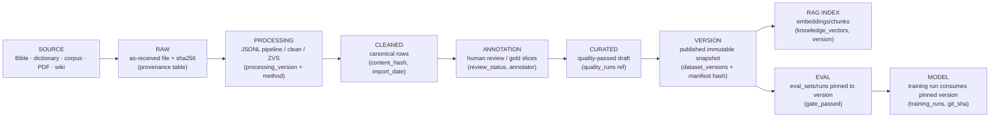

# Data Provenance & Chain of Custody

> **Batch 2/3** of the Data Platform docs series. **Status: PROPOSED** for the target column
> set and audit extension; the L1.3 provenance columns and `data_audit_log` already exist
> (**EXISTS**). Constraints: every dataset has provenance; transformations reproducible; human
> corrections auditable ([ADR-015](../adr/ADR-015.md) — migrate, don't rename).
> Companions: [data model](data-model.md) · [versioning](versioning.md) · [quality](quality.md) ·
> `docs/governance/credits-license-inventory.md` · `docs/governance/data-governance.md`.

## 1. The provenance chain

Each arrow is a **recorded hop**: file hash + processing version + run id + audit row. A record
must be able to travel the chain backwards without guessing.

## 2. Standard provenance columns

Target column set for row-level lineage (client §42 column list), aligned with the **L1.3 columns
already added** to `dictionary`, `vocabulary`, `zolai_vocabulary` (additive, legacy `pos` untouched):

| Column | Meaning | Status in L1.3 lexicon tables | Elsewhere |
|---|---|---|---|
| `source` | logical source name (legacy, already present on `dictionary`) | EXISTS (pre-L1.3) | `provenance.source`, `import_log.source_file` |
| `source_type` | enum-ish: `bible` / `dictionary` / `corpus` / `pdf` / `wiki` / `web` | EXISTS (`DEFAULT 'unknown'`) | `knowledge_vectors.source_type` EXISTS |
| `source_url` | upstream URL when applicable | EXISTS (`NULL`) | `sources.source_url` (PROPOSED) |
| `creator` | upstream creator/translator/agency | EXISTS (`NULL`) | — |
| `license` | license of the source material | EXISTS (`NULL`) | `sources.license`; inventory in `docs/governance/credits-license-inventory.md` |
| `collection_date` | when the source material was collected | EXISTS (`NULL`) | — |
| `import_date` | when we ingested it | EXISTS (`NULL`) | `import_log.imported_at` EXISTS |
| `processing_version` | pipeline version stamp (e.g. `l1.3-pos-backfill`) | EXISTS (`NULL`) | `import_log.version`, `provenance.version` EXISTS |
| `processing_method` | how the row was produced (script/transform id) | **PROPOSED (not yet a column)** | proxies today: `provenance.generator_script` EXISTS |
| `review_status` | `unknown` → `reviewed` → `adjudicated` | EXISTS (`DEFAULT 'unknown'`) | `canonical_sentences.verified_at/verified_by` EXISTS |
| `confidence` | 0.0–1.0 (CHECK-constrained where present) | EXISTS (`REAL NULL`) | CHECKs on `translations`, `foundation_*` EXISTS |

Alignment rule: **extend, don't fork** — tables outside the lexicon family get the same column
names when Phase 9 lands them (additive `ALTER TABLE ... ADD COLUMN` with documented reverse SQL,
the `migrations.py` pattern). No two names for the same concept.

## 3. Chain of custody (`data_audit_log`)

Existing shape (**EXISTS**, 30,745 rows): `table_name`, `row_id`, `field`, `old_value`,
`new_value`, `changed_at`, `reason`, `version`, `content_hash`.

**Proposed additive extensions (Phase 9):**

| Column | Answers | Note |
|---|---|---|
| `actor_id` / `actor_type` | *who* (user id from RBAC, or `system`/`cron`/api-key prefix) | links to identity domain; never stores raw secrets |
| `run_id` | *by which pipeline run* | FK-ish to `pipeline_runs` |
| `provenance_ref` | *from which source/version* | pointer into `provenance`/`sources`/`dataset_versions` |

Guarantees: append-only (never UPDATE/DELETE), backed up in the Phase 0 baseline, and human
corrections are first-class audit rows (client constraint: corrections auditable).

## 4. Every provenance question → where it is answered

Client §42 question list, each mapped to the answering mechanism:

| # | Question | Answered by | Status |
|---|---|---|---|
| 1 | Where did this sentence come from? | `source` + `source_type` + `source_url` on the row; file-level `provenance.sha256` | PARTIAL (columns on lexicon tables; extend to corpus tables) |
| 2 | Which dataset version contains it? | `dataset_versions` + manifest record hash; `version` columns (`import_log.version`, row `version`) | PROPOSED table (ADR-007); version columns EXISTS |
| 3 | Who reviewed it? | `review_status` + annotator/`verified_by` + `data_audit_log.actor_id` | PARTIAL (`verified_by` EXISTS; actor_id PROPOSED) |
| 4 | What transformations were applied? | `processing_version` + `processing_method` (+ `import_log` / `provenance.generator_script`) | PARTIAL — `processing_method` PROPOSED |
| 5 | Which quality checks passed? | `quality_runs` → `quality_results` for that `dataset_version_id` | PROPOSED (ADR-005); eval gates EXISTS today |
| 6 | What is the upstream source? | `sources` registry row + `creator`/`license`/`collection_date` | PROPOSED registry; columns EXISTS on lexicon |
| 7 | Which DVC/data version? | manifest hash in `dataset_versions.manifest_sha256` (DVC deferred until >1 GB artifacts) | CONFIGURE (ADR-007); DVC = DEFER |
| 8 | Which RAG index uses it? | `knowledge_vectors.import_batch_id` + `version`; `rag_traces.dataset_version_id` (planned) | PARTIAL (batch EXISTS; traces PROPOSED) |
| 9 | Which eval used it? | `eval_runs` records set + timestamp; pinned `dataset_version_id` once Phase 9 adds it | PARTIAL (eval runs EXISTS; version pin PROPOSED) |
| 10 | Which model was trained on it? | `training_runs` rows (dataset reference, git sha, output artifact) + future MLflow only if triggered | PARTIAL — extend `training_runs` with `dataset_version_id` |

**Gaps = PROPOSED column/table work in Phases 2 and 9** — additive only. Where an answer is
"PARTIAL", the mechanism exists but needs a column or a link, not a new system.

## 5. Source → table lineage (catalog view)

Lineage is surfaced, not just stored:

- `provenance` rows: file → generator script → target table → status/change_log (**EXISTS**).
- `sources` registry: source → which datasets/tables cite it (**PROPOSED**, [data model §1.2](data-model.md#12-source--where-data-came-from)).
- Lightweight catalog (`/api/v1/catalog`, [ADR-004](../adr/ADR-004.md)): generated
  source→table→dataset-version listing rendered into `docs/database/` on release (**BUILD**).
- Staging lineage: `*_import` tables record `source_file` + `sha256` + `rows_imported`
  (`import_log`, **EXISTS**, 92 runs; `jsonl_import_log` exists but is
  empty — 0 rows, duplicate/legacy).

## 6. Credits & licenses

- [`docs/governance/credits-license-inventory.md`](../governance/credits-license-inventory.md) — per-source credit + license rows (inventory of record).
- [`docs/governance/license-audit-checklist.md`](../governance/license-audit-checklist.md) — 4-phase audit checklist (KR2.3).
- [`docs/governance/data-governance.md`](../governance/data-governance.md) — handling rules; [`docs/governance/public-vs-private.md`](../governance/public-vs-private.md) — exposure rules.
- `data/CREDITS.md` — in-repo attribution for the DB build (mirrors the governance inventory).
- Rule: **no dataset publishes without a license/credit row** (quality rule `VALID_SOURCE` +
  publish gate, [quality §2.1](quality.md#21-generic-rules)).

## 7. Related docs

- [Data model](data-model.md) · [Versioning](versioning.md) · [Quality](quality.md) ·
  [Dataset lifecycle](dataset-lifecycle.md)
- [ADR-007](../adr/ADR-007.md) · [ADR-012](../adr/ADR-012.md) · [ADR-015](../adr/ADR-015.md)
- [Current-state §7 G13](../architecture/current-state.md) — provenance-not-surfaced gap
