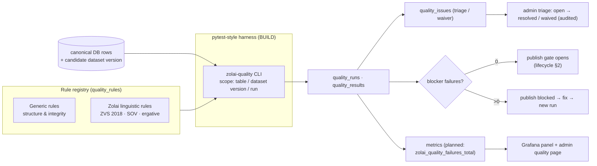

# Data Quality Architecture

> **Batch 2/3** of the Data Platform docs series. **Status: PROPOSED** — registry + harness are
> BUILD items (Phase 5); eval gates in `eval_runs` already exist and are **not** replaced.
> Decision: [ADR-005](../adr/ADR-005.md) (custom pytest-style harness + DB rule registry;
> DEFER GX/Soda). Companions: [data model §1.6](data-model.md) · [lifecycle](dataset-lifecycle.md) ·
> [observability](../architecture/observability.md).

## 1. Architecture

Principles:

- **Custom Python, not a platform.** Linguistic rules are Python anyway; a generic engine would
  still be wrapped by custom code. GX/Soda are deferred until generic non-linguistic rules exceed
  ~50 ([ADR-005](../adr/ADR-005.md)).
- **pytest-style:** each rule is a parameterized check function over a scope (table, dataset
  version, or file); running the harness = running the test suite with a JSON+DB report.
  Same ergonomics as the existing 1,010-test zolai-core suite; failures read like test failures.
- **Rules are data** (`quality_rules` rows): code, severity, action, scope, params, enabled —
  so the admin can list/inspect them and runs can cite exactly which rule version fired.
- **Idempotent & re-runnable:** a run never mutates data; it only records results.

## 2. Rule registry

Severity: **blocker** (publish-stopping) · **error** (must fix, non-blocking for drafts) ·
**warning** (review) · **info** (reporting). Action: **fail_run** · **record_issue** · **warn** ·
**quarantine** (row flagged, excluded from serving).

### 2.1 Generic rules

| rule_code | Scope | Severity | Action | Checks |
|---|---|---|---|---|
| `TEXT_NOT_EMPTY` | row field | blocker | fail_run | no empty/whitespace-only text in content fields |
| `VALID_UNICODE` | row field | blocker | fail_run | well-formed Unicode; no HTML entities/tags; NFC-normalizable |
| `VALID_LANGUAGE` | row field | error | record_issue | script/charset matches declared language (Zolai `[a-z-]`, EN, MM script) — no mixed-language junk |
| `VALID_SOURCE` | row/dataset | blocker | fail_run | every row's `source_type` exists in the `sources` registry (or known legacy set) |
| `VALID_RECORD_HASH` | row | blocker | fail_run | `content_hash` recomputes from stored fields |
| `NO_DUPLICATE_RECORD` | row | error | record_issue | natural key / `content_hash` uniqueness within scope |
| `VALID_DATASET_VERSION` | dataset version | blocker | fail_run | manifest matches rows: count, schema, hashes; version number follows §3 of [lifecycle](dataset-lifecycle.md) |
| `NO_ORPHAN_REFERENCE` | relation | error | record_issue | FK-ish references resolve (alignments→verses, senses→entries, annotations→sentences) |

### 2.2 Zolai linguistic rule registry

| rule_code | Scope | Severity | Action | Checks |
|---|---|---|---|---|
| `VALID_POS` | lexicon/token | error | record_issue | `pos_canonical` ∈ 17-tag UPOS allowlist (POS_SPEC v0.1); legacy `pos` never judged directly |
| `VALID_TRANSLATION_PAIR` | pair row | error | record_issue | ZO↔EN side non-empty, language-correct, both attested (dictionary/Bible/corpus) |
| `VALID_GRAMMAR_PATTERN` | pattern row | error | record_issue | pattern parses; SOV slot order consistent; negation/question templates well-formed |
| `ZVS_2018` | text | blocker (published) / warning (draft) | fail_run / warn | no forbidden deprecated forms (`pathian`, `ram`, `fapa`, `bawipa`, `siangpahrang`, `cu`/`cun`) outside quoted historical/Bible contexts — same semantics as the `zolai-zvs` validator |
| `SOV` | sentence | error | record_issue | verb-final ordering; content-question form `bang hang` + verb + subject + `hiam` |
| `ERGATIVE` | sentence | warning | record_issue | transitive-agent marker `in` used correctly; no `in` on intransitive subjects |

Notes:

- Rule parameters (allowed exception lists, per-table field maps) live in `quality_rules.params`,
  so the ZVS historical-exception handling (Bible-only allowances) is configuration, not code
  forks.
- Severity for `ZVS_2018` depends on lifecycle state: published data must be fully ZVS-clean;
  drafts may carry warnings while being cleaned.
- New linguistic rules (tone sandhi, syllable structure, compound validity) are registry rows +
  check functions — no harness changes.

## 3. Storage

| Table | Grain | Key fields |
|---|---|---|
| `quality_rules` | one row per rule | `rule_code` (PK), `category` (`generic`/`linguistic`), `severity`, `action`, `scope`, `params`, `enabled` |
| `quality_runs` | one row per execution | `started_at`, `finished_at`, `status` (`running/passed/failed`), `trigger` (`cron/manual/publish/cli`), `rules_run`, `rules_failed`, `dataset_version_id?`, `pipeline_run_id?` |
| `quality_results` | one row per (run × rule × scope) | `rows_checked`, `rows_failed`, `duration_ms`; unique `(run_id, rule_code, scope_key)` |
| `quality_issues` | one row per failing record | `table_name`, `row_id`, `payload` (failing values), `severity`, `status` (`open/resolved/waived`), `waived_by`, `waived_reason` |

Specs (PK/FK/index): [data model §1.6](data-model.md#16-quality--rule-registry--run-results).
Retention: runs/issues kept as history (they are provenance evidence for published versions);
waivers are audited (`data_audit_log`).

## 4. Harness mechanics (pytest-style, [ADR-005](../adr/ADR-005.md))

- Check functions live beside the data layer in `zolai-core` (e.g. `zolai/data/quality/`),
  registered against `quality_rules` rows at import; the CLI `zolai-quality` (PROPOSED entry
  point) selects scope: `--table dictionary`, `--dataset-version en-zo@1.3.0`, `--rule ZVS_2018`.
- Output: JUnit-style console summary + `quality_runs`/`quality_results`/`quality_issues` rows +
  machine-readable JSON artifact for CI.
- **Integration tag: BUILD** in Phase 5; **INTEGRATE** with the publish gate (Phase 9) and cron
  (Phase 7). Runs also emit the planned `zolai_quality_failures_total` metric
  ([observability §1.1](../architecture/observability.md)).
- CI: lightweight subset (blocker rules on changed tables) runs per-PR; full registry runs nightly
  via cron + `pipeline_runs` record ([ADR-006](../adr/ADR-006.md)).

## 5. Surfacing

| Surface | What | Tag |
|---|---|---|
| Grafana (existing stack) | operational panel: failures per rule (planned metric), pass/fail trend of runs, latest publish-gate status | **KEEP/CONFIGURE** — new panel in the existing `linguistic-pipeline`/`data` folders; any attached alert joins the 3-way parity test |
| Admin (zolai-web) | Quality Runs list → run detail (per-rule results) → issue triage (open/resolve/waive with RBAC `quality:*`) | **BUILD** (ADR-009) |
| `/api/v1/catalog` | latest run status per dataset version | **BUILD** (ADR-004) |
| Console/CI | pytest-style failure report | **BUILD** |

Data quality results are **operational observability**; BI/analytics remain separate and deferred
(no Grafana/Superset/OpenMetadata duplication).

## 6. Data quality ≠ model quality — no single score

| | Data quality | Model/answer quality |
|---|---|---|
| Question | Is the stored data well-formed, sourced, ZVS-clean, unduplicated? | Does the system translate/answer/teach correctly? |
| Store | `quality_runs` / `quality_results` / `quality_issues` | `eval_sets` / `eval_cases` / `eval_runs` (gates) |
| Cadence | every ingest + nightly + publish gate | `zolai-eval` runs surfaced in `/api/metrics/eval` |
| Owner | data pipeline | eval/benchmark lane (L5 ZolaiBench) |

**No single "quality score."** Averaging a `ZVS_2018` failure rate with an eval F1 produces a
number nobody can act on. Surfaces report **per-rule pass/fail** and **per-run gate status**;
cross-cutting roll-ups (if ever needed) are explicit, documented, and never replace the detail.
Eval gates are unaffected by quality-run outcomes — they stay independent lanes.

## 7. Revisit triggers

| DEFER | Revisit when |
|---|---|
| GX Core (Apache 2.0) | generic non-linguistic rules > ~50 |
| Soda Core | never as-is — **REJECT** (ELv2 since v4) |
| dbt tests | only if a dbt DAG ever exists (there is none) |

## 8. Related docs

- [ADR-005](../adr/ADR-005.md) · [Dataset lifecycle](dataset-lifecycle.md) (publish gate) ·
  [Provenance](provenance.md) (rules that validate lineage) · [Data model](data-model.md)
- [Observability](../architecture/observability.md) · [Tool matrix §5](../research/data-platform-tool-matrix.md)
