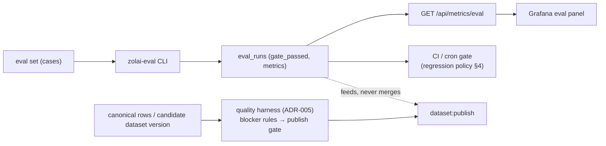

# Pipelines — Evaluation & Gates

> **Batch 3/3** of the Data Platform docs series. **Status:** storage + gate surfacing are
> **CONFIRMED** (DB-first eval exists: `zolai-eval` → `eval_runs` → `/api/metrics/eval`);
> the regression policy and quality-harness wiring are **PROPOSED** (Phase 7/10) with one
> **needs-founder** threshold (§4). Decisions: [ADR-012](../adr/ADR-012.md) (DB-first RAG
> observability, DEFER Langfuse/Phoenix) · [ADR-005](../adr/ADR-005.md) (quality harness —
> separate lane). Companions: [quality](../data/quality.md) · [evaluation admin
> workflow](../admin/workflows.md#4-inspect-eval-regression) · [observability](../architecture/observability.md).

## 1. Storage: `eval_sets` / `eval_cases` / `eval_runs` (DB-first, EXISTS)

| Table | Grain | Live counts (2026-09-29) | Key fields |
|---|---|---|---|
| `eval_sets` | one row per eval set | **3**: `smoke` (36), `eval_v1` (110), `benchmark_qa` (127) | `set_name` (unique), `case_count`, `updated_at` |
| `eval_cases` | one case per row — payload stored **verbatim** (JSON) | **273** | `(set_name, kind, ordinal)` unique; `is_active` |
| `eval_runs` | one row per execution — **append-only history** | gate history | `set_name`, `gate_passed`, `metrics` (JSON), `duration_ms`, `source` (trigger) |
| `monitoring_annotations` | Grafana dashboard events | EXISTS | `time`, `kind` |

Seeding: `zolai-core/scripts/eval/seed_eval_sets.py`. CLI: **`zolai-eval`** (entry point in
`pyproject.toml`). Specs: [data model §1.8](../data/data-model.md#18-evaluation--sets-cases-run-history-gates).

**Invariants:**

- Runs are **never updated or deleted** — history *is* the model/data quality record.
- Cases are versioned by edit + `eval_runs.source` context; editing a case set is a reviewed
  change (eval-set drift is one of the three regression classes, [§3](#3-regression-triage)).
- Model/answer quality lives **only** here; data quality lives in `quality_*`
  ([quality §6](../data/quality.md#6-data-quality--model-quality--no-single-score)) — no
  merged score, ever.

## 2. Gate wiring

| Wiring | Status | Detail |
|---|---|---|
| `zolai-eval` → `eval_runs` | **EXISTS** | every run records `gate_passed` + metrics JSON |
| `/api/metrics/eval` (metrics router) | **EXISTS** | 11 REST metrics endpoints; eval one is the gate surface |
| Grafana eval panel | **EXISTS/KEEP** | part of the just-built stack ([ADR-002](../adr/ADR-002.md)) — "extend, don't replace" |
| Eval gate → CI/cron | **CONFIGURE** (Phase 7/10) | nightly `zolai-eval --set gate` + PR-time `smoke` subset |
| Quality harness → publish gate | **BUILD** (Phase 5/9, [ADR-005](../adr/ADR-005.md)) | quality blockers gate *data* publish; eval gates gate *model/answer* changes — complementary, not the same check |
| `rag_traces` correlation | **CONFIGURE** (Phase 10, [ADR-012](../adr/ADR-012.md)) | optional `eval_run_id` link when RAG regressions become untraceable from evals |

Both gates may be required to ship a *combined* release (data publish + model change), but a
quality pass never excuses a failed eval gate, and vice versa.

## 3. Regression triage

Three classes, classified before any fix ([admin workflow §4](../admin/workflows.md#4-inspect-eval-regression)):

| Class | Signal | First suspect |
|---|---|---|
| **Data change** | drop appears after a dataset publish/promotion | `dataset_versions`, quality runs, `data_audit_log` in the window |
| **Code change** | drop appears after a retrieval/grammar/API change | `git_sha` in `pipeline_runs`/run notes; `/api/metrics/performance` for latency-shaped regressions |
| **Eval-set change** | drop appears after case edits | review of the `eval_cases` diff — case edits require the same review discipline as data edits |

Escalation: if a drop cannot be attributed from `eval_runs` + audit + run records, that is
the **revisit trigger** for RAG tracing (`rag_traces`, Phoenix-first per
[ADR-012](../adr/ADR-012.md) / [tool matrix §12](../research/data-platform-tool-matrix.md)).

## 4. Regression policy (PROPOSED — threshold needs-founder)

**Rule R-EVAL-1 (draft):** a gated eval run **fails the build/release** when a tracked
metric drops below `baseline − threshold`, where `baseline` = best `gate_passed=true` value
for that set over the trailing window (default: last 10 passing runs).

| Parameter | Proposed default | Status |
|---|---|---|
| Primary metric | per-task F1 (or exact-match where F1 is not defined, e.g. syllable segmentation — see [benchmarks](../research/benchmarks.md)) | PROPOSED |
| **Threshold** | **absolute F1 drop > 0.02 (2 points)** vs baseline → gate fail | **needs-founder** (default proposal) |
| Relative guard | or > 5% relative drop, whichever is stricter | needs-founder |
| Scope | gated sets (`smoke` in CI, `eval_v1` nightly, `benchmark_qa` on release candidates) | PROPOSED |
| Waiver | intentional trade-off → update threshold/baseline via `settings:write` + audit event; **never** edit past `eval_runs` rows | PROPOSED |
| Trend vs cliff | two consecutive mild drops (≤ threshold each) still fail (prevents slow drift past the gate) | PROPOSED |

Why a founder decision: the threshold encodes an **accuracy tolerance for Zolai language
output**, not an engineering constant — the wrong number either blocks legitimate data
updates or lets real regressions ship. Until signed off, runs record metrics and the admin
shows deltas, but CI treats the threshold as advisory (**gate runs, no hard fail**).

Sign-off record: *(pending — founder sets `eval_gate_threshold` in settings; this row flips
to CONFIRMED with the date).*

## 5. Run matrix (v1)

| Set | Cases | Cadence | Gate | Trigger |
|---|---|---|---|---|
| `smoke` | 36 | per-PR (CI subset) | fail build | code change |
| `eval_v1` | 110 | nightly | fail next release | cron (`pipeline_runs`) |
| `benchmark_qa` | 127 | release candidate / weekly | fail release | manual (`eval:run`) |

Each run writes an `eval_runs` row with `source` = `ci|cron|manual|release`; the admin
Evaluations page and `/api/metrics/eval` read the same rows.

## 6. Related docs

- [Quality harness](../data/quality.md) (data lane) · [Observability](../architecture/observability.md)
- [Admin: evaluations](../admin/information-architecture.md#27-evaluations-adminevaluations) · [Regression workflow](../admin/workflows.md#4-inspect-eval-regression)
- [ADR-005](../adr/ADR-005.md) · [ADR-012](../adr/ADR-012.md) · [Tool matrix §12](../research/data-platform-tool-matrix.md)
- [Migration plan Phase 10](../planning/DATA_PLATFORM_MIGRATION.md) · [Backlog P1/P2](../planning/DATA_PLATFORM_BACKLOG.md)
