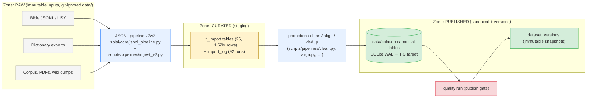

# Pipelines — Ingestion

> **Batch 3/3** of the Data Platform docs series. **Status: CONFIRMED** for the *existing*
> path (it runs today, 92 logged imports); **PROPOSED** for the `pipeline_runs` bookkeeping
> layered on top (Phase 7, [ADR-006](../adr/ADR-006.md)).
> Companions: [processing](processing.md) · [evaluation](evaluation.md) ·
> [data model §1.2/§1.7](../data/data-model.md) · [provenance](../data/provenance.md) ·
> [current-state §6](../architecture/current-state.md).
>
> **Tags:** **KEEP** existing JSONL pipeline + `import_log` (works today) ·
> **CONFIGURE** `pipeline_runs` bookkeeping + idempotency checks (Phase 7) ·
> **BUILD** `sources` registry rows where provenance gaps exist (Phase 6).

## 1. Flow: source → staging → canonical

| Zone | What lives there | Mutability |
|---|---|---|
| **RAW** | downloaded/extracted source files in git-ignored `data/` (+ their `provenance` rows) | never edited in place; replaced by a new file + new provenance row |
| **CURATED** | `*_import` staging tables — intermediate products of the JSONL pipeline | re-runnable, truncatable-by-rerun, archived (never dropped) per [archive plan](../database/archive-plan.md) |
| **PUBLISHED** | canonical tables + immutable `dataset_versions` snapshots | canonical = audited writes only; published snapshots = **immutable** ([ADR-007](../adr/ADR-007.md)) |

Constraint echoes: large data never in Git; published datasets immutable; every dataset has
provenance; transformations reproducible (same input file + same script version = same rows).

## 2. The JSONL pipeline (existing, CONFIRMED)

| Piece | Role |
|---|---|
| `zolai/core/jsonl_pipeline.py` (+ `_v2`, `_v3`) | parse → validate → load JSONL batches into `*_import` staging |
| `zolai-core/scripts/pipelines/` | `ingest_v2.py` · `clean.py` · `align.py` · `deduplicate.py` · `export.py` · `collect.py` · `convert_linguistics.py` · `convert_usx.py` · `run.py` |
| Promotion step | staging → canonical table with mapping + validation (the `*_import` → canonical hand-off) |
| `import_log` | **run record per import**: `batch_id`, `source_file`, `table`, `rows`, `sha256`, `status`, `imported_at` (92 runs) |
| `provenance` | **file-level lineage**: filename, sha256, row_count, generator script, status, change_log |

Note: `import_log` (and the empty legacy `jsonl_import_log`, 0 rows) belong to the **pipeline domain** of the
[data model](../data/data-model.md) — they also answer source questions, but they are run
records, not the source registry (`sources`, PROPOSED).

## 3. Idempotency

| Mechanism | Rule |
|---|---|
| **Content hash** | input file's `sha256` is recorded in `provenance` and `import_log`; re-ingesting the same hash is a no-op (skip + log `status=skipped`) |
| **Record `content_hash`** | per-row hash over stored fields — dedup and re-runs key on it (`NO_DUPLICATE_RECORD`, `VALID_RECORD_HASH` rules) |
| **Natural keys** | promotion upserts on natural keys (e.g. `zolai`, `(book,chapter,verse,version)`) — never blind appends |
| **Batch identity** | `batch_id` scopes a run; a failed batch can be re-run without touching rows from other batches |
| **Staging re-run** | `*_import` tables may be truncated and reloaded (they are CURATED, not published) — canonical rows only ever change through audited promotion |

**Invariant:** running any ingestion job twice with the same inputs leaves row counts and
hashes unchanged. This is checked by the Phase 0 baseline checksums and by re-running the
job under dry-run.

## 4. Run records

Every ingestion execution produces exactly one run record:

| Era | Record | Status |
|---|---|---|
| Today | `import_log` (imports, 92 runs; `jsonl_import_log` empty) | **EXISTS** |
| Phase 7 (ADR-006) | `pipeline_runs` row: `pipeline_name`, `trigger` (`cron\|manual\|cli`), `started_at`, `finished_at`, `status` (`running\|success\|failed\|skipped`), `rows_in`, `rows_out`, `error`, `git_sha`, `params`, `host` | **PROPOSED** |

`git_sha` + `params` make transformations **reproducible** (provenance question: *which
transformations*). Legacy import logs are not merged into `pipeline_runs` — they coexist
([ADR-015](../adr/ADR-015.md): migrate, don't rename). Run counts feed the planned
`zolai_worker_jobs_total` / `zolai_queue_depth` metrics
([observability §1.1](../architecture/observability.md)).

## 5. Failure handling

| Failure | Handling |
|---|---|
| Parse/shape error in source file | batch **aborts before promotion**; `status=failed` + `error`; staging rows for that batch stay for inspection, canonical untouched |
| Validation error (unicode/empty/wrong language) | row quarantined or batch failed per run config; nothing partial reaches canonical silently |
| Mid-promotion crash | promotion is transactional where the store allows; on SQLite, re-run resumes from natural keys — idempotency makes the retry safe (backup first if the batch is large) |
| Duplicate re-ingest | detected by content hash → `skipped`, logged |
| Quality blockers found post-promotion | issue rows open; if the data was destined for publish, the [publish gate](../data/dataset-lifecycle.md) blocks — promotion to *staging-adjacent* canonical working rows is corrected by a new audited change, never by silent overwrite |
| Run bookkeeping missing | Phase 7 adds a CI check: a pipeline entry point that mutates data without opening a `pipeline_runs` row is a regression |

Every mutating path writes `data_audit_log`; every run writes its run record — the two are
linked by `pipeline_run_id` where the FK exists (Phase 7+).

## 6. Curation-zone rules

1. RAW files are **append-only inputs**; a corrected source is a new file + provenance row.
2. CURATED (`*_import`) may be rebuilt from RAW at any time — this is the reproducibility
   guarantee; archive (not delete) per [archive plan](../database/archive-plan.md) (KR2.4,
   founder approval required).
3. PUBLISHED rows change only through audited pipelines; published snapshots never change.
4. Nothing crosses a zone without provenance and, for publish, a passing quality run.

## 7. Related docs

- [Processing jobs](processing.md) · [Evaluation](evaluation.md)
- [Data model §1.7 pipeline](../data/data-model.md) · [Provenance](../data/provenance.md)
- [Archive plan (KR2.4)](../database/archive-plan.md) · [`tables.md`](../database/tables.md)
- [ADR-006 (no orchestrator)](../adr/ADR-006.md) · [ADR-015 (migrate-not-rename)](../adr/ADR-015.md)
