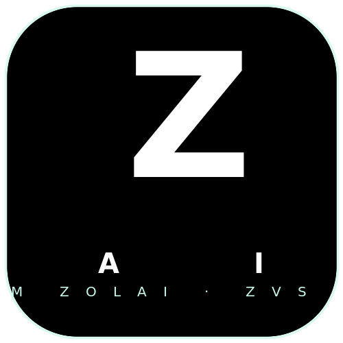

# 💚 Zolai AI — Preserving Tedim Zolai with AI
<p align="center"></p>


**Bilingual (Tedim Zolai ⇄ English) AI toolkit for the Zomi people.**

We digitize, standardize, and preserve the **Zolai** language under the **ZVS 2018
orthography** — high-purity bilingual corpora → a **RAG-first knowledge brain**
(i.e. no raw fine-tuning — existing AIs consume Zolai knowledge as context) →
open learner platform + offline desktop app.

## Repositories

| Repo | What it does |
|------|-------------|
| [`zolai-core`](https://github.com/Zolai-AI/zolai-core) | Python package + FastAPI + **RAG Knowledge Brain** (ingest/retrieve/ngram) |
| [`zolai-web`](https://github.com/Zolai-AI/zolai-web) | Next.js + Hono + Prisma learner platform |
| [`zolai-tauri`](https://github.com/Zolai-AI/zolai-tauri) | Offline Tauri desktop app (bundled server + GGUF) |
| [`zolai-datasets`](https://github.com/Zolai-AI/zolai-datasets) | Bilingual corpora, dataset build scripts, HF/Kaggle pointers |
| [`zolai-training`](https://github.com/Zolai-AI/zolai-training) | LoRA/QLoRA fine-tuning, adapter merge + GGUF export |
| [`zolai-wiki`](https://github.com/Zolai-AI/zolai-wiki) | Knowledge base: grammar, vocabulary, curriculum, culture |
| [`zolai-ai`](https://github.com/Zolai-AI/zolai-ai) | Monorepo (source of truth, mirrors the components) |
| `.github` | **This** org profile + community + CI |

## How it fits together

```
web ──REST──▶ core ◀──RAG── wiki
tauri ──REST/GGUF──▶ core
datasets ──HF/Kaggle──▶ core ──inference──▶ (existing AI, as context)
training ──▶ datasets + adapters
```

## Our principles

- **RAG-first, no raw fine-tuning** — Zolai knowledge is *embedded and injected* into
  capable general AIs, not a Zolai-only base model.
- **ZVS 2018 compliant** everywhere — grammar, vocabulary, wiki, and all output.
- **No secrets in code** — tokens load from `.env` only; `.env.example` is placeholders.
- **Datasets/models on HuggingFace Hub / Kaggle**, never bloated into git.

## Get started

- Core RAG: `pip install -e .` in `zolai-core` → `python scripts/kg/smoke_test.py`
- Web: `cd zolai-web && bun install && bun run dev`
- Wiki: `zolai-wiki` — canonical knowledge base (1529 files).

## Contribute

- **Native Tedim (Zomi) speakers** — validate corpus + ZVS 2018 compliance.
- **Linguists** — Tibeto-Burman grammar, sentence-structure, word-prediction data.
- **ML engineers** — low-resource NLP, embeddings/RAG, fine-tuning.
- **Web/desktop devs** — Next.js + Tauri.

Conventional commits · PRs land on `main` · see `community/CONTRIBUTING.md`.

> Building a thriving Zolai AI ecosystem for the Zomi people. 🇿🇲
